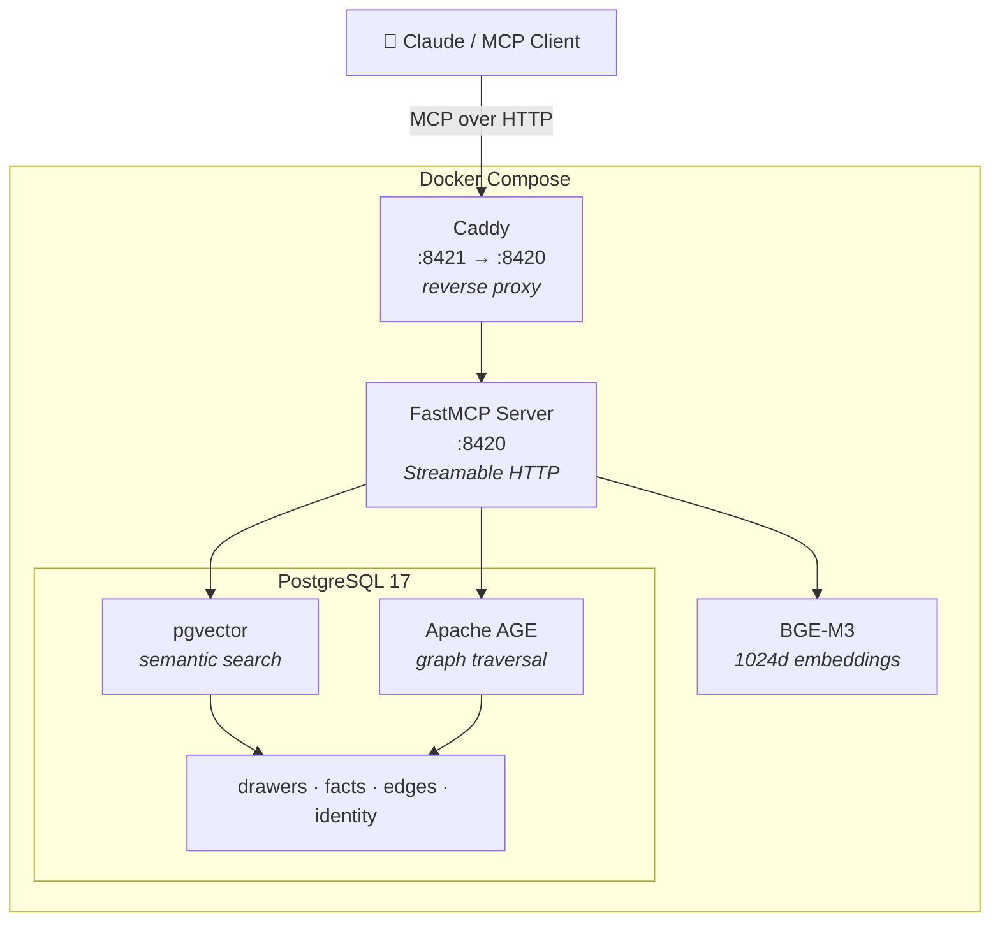

# HiveMem

Personal knowledge system with semantic search and temporal knowledge graph.

MCP server backed by PostgreSQL 17 (pgvector + Apache AGE) with BGE-M3 embeddings.

## Features

- 16 MCP tools (search, knowledge graph, time machine, wake-up, import, ...)
- Semantic search with BGE-M3 (1024 dims, 100+ languages, <1s queries)
- Temporal knowledge graph (valid_from/valid_until, historical queries)
- Multi-hop graph traversal (recursive CTEs / Apache AGE)
- Docker Compose deployment (one command: `docker compose up`)
- Daily pg_dump backups

## Quick Start

```bash
git clone https://github.com/ufelmann/HiveMem.git
cd HiveMem
cp .env.example .env
docker compose up -d
# First start downloads BGE-M3 model (~2.2GB)
```

## MCP Integration

```json
{
  "mcpServers": {
    "hivemem": {
      "type": "http",
      "url": "http://localhost:8421/mcp"
    }
  }
}
```

## Architecture



### Tools (16)

| Category | Tools |
|---|---|
| **Read** (9) | `search` · `search_kg` · `get_drawer` · `list_wings` · `list_rooms` · `traverse` · `time_machine` · `wake_up` · `status` |
| **Write** (4) | `add_drawer` · `kg_add` · `kg_invalidate` · `update_identity` |
| **Import** (2) | `mine_file` · `mine_directory` |
| **Admin** (1) | `health` |

## License

MIT
