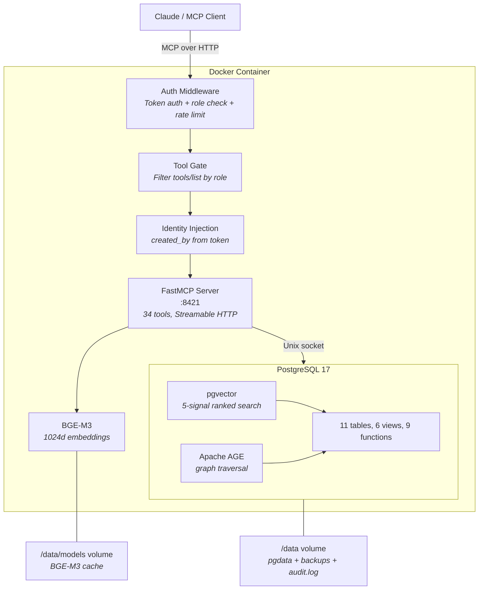
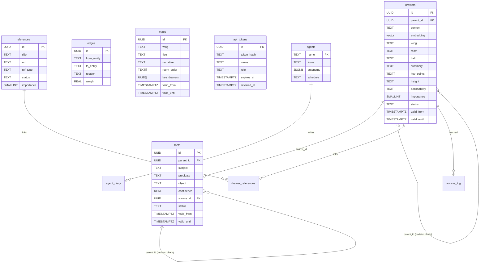

# HiveMem

Personal knowledge system with semantic search, temporal knowledge graph, and progressive summarization.

MCP server backed by PostgreSQL 17 (pgvector + Apache AGE) with BGE-M3 embeddings. 34 tools, append-only versioning, role-based token auth, agent fleet with approval workflow.

## Vision & Research

HiveMem is built on the premise that well-structured external knowledge systems are not just storage -- they extend cognition. Every design decision is grounded in research on how humans process, retain, and retrieve information.

### Scientific Foundations

| Theory | Key Insight | HiveMem Consequence |
|---|---|---|
| **Working Memory Limitation** (Cowan, 2001) | Humans hold ~4 items in working memory | Wake-up context delivers max 15-20 items, prioritized by importance |
| **Cognitive Load Theory** (Sweller, 1988) | Disorganized information wastes mental resources needed for thinking | Wings/Rooms/Halls taxonomy, Maps of Content, progressive summarization |
| **Extended Mind Thesis** (Clark & Chalmers, 1998) | Well-used external tools become genuine extensions of cognition | Proactive capturing, graph traversal for hidden connections, synthesis agents |
| **Forgetting Curve** (Ebbinghaus, 1885) | 90% of learned information is lost within a week | Immediate capture at session end, proactive storage of decisions |

### PKM Frameworks

**Zettelkasten** (Luhmann) -- Atomic notes + linking. Knowledge emerges from connections, not hierarchies. Luhmann produced 70 books and 400 papers from 90,000 linked notes.

*What HiveMem adopts:* Atomic drawers (one topic per drawer), knowledge graph as linking (facts, edges), cross-wing tunnels as cross-references.
*What HiveMem does differently:* No manual linking -- LLM agents detect connections. Semantic search instead of manual navigation. Temporal validity -- notes can expire.

**PARA** (Tiago Forte) -- Projects / Areas / Resources / Archive. Sorted by actionability, not topic.

*What HiveMem adopts:* Actionability field (actionable / reference / someday / archive). Wake-up prioritizes actionable over reference. Wings map to Areas.

### References

- Cowan, N. (2001). *The magical number 4 in short-term memory.* Behavioral and Brain Sciences, 24(1), 87-114.
- Sweller, J. (1988). *Cognitive Load During Problem Solving.* Cognitive Science, 12(2), 257-285.
- Clark, A. & Chalmers, D. (1998). *The Extended Mind.* Analysis, 58(1), 7-19.
- Ebbinghaus, H. (1885). *Uber das Gedachtnis.*
- Ahrens, S. (2017). *How to Take Smart Notes.* CreateSpace.
- Forte, T. (2022). *Building a Second Brain.* Atria Books.

## Features

- **34 MCP tools** across search, knowledge graph, progressive summarization, agent fleet, references, and admin
- **5-signal ranked search** -- semantic similarity + keyword match + recency + importance + popularity
- **Append-only versioning** -- never lose history, revise with parent_id chains, point-in-time queries
- **Progressive summarization** (L0-L3) -- content, summary, key_points, insight per drawer
- **Temporal knowledge graph** -- facts with valid_from/valid_until, contradiction detection, multi-hop traversal
- **Role-based token auth** -- multiple tokens, 4 roles (admin/writer/reader/agent), per-role tool visibility
- **Agent fleet** with approval workflow -- agents write pending suggestions, only admins approve
- **Maps of Content** -- curated narrative overviews per wing, append-only versioned
- **References & reading list** -- track sources, link to drawers, filter by type/status
- **Single container deployment** -- PostgreSQL + MCP server in one `docker run`
- **195 tests** with testcontainers -- unit, integration, HTTP end-to-end, performance, security, concurrency

## Prerequisites

- [Docker](https://docs.docker.com/get-docker/) (v20+)
- ~4 GB free disk space (BGE-M3 model ~2.2 GB + Docker image ~3.5 GB)
- ~3 GB free RAM (BGE-M3 embedding model runs on CPU)

## Quick Start

### Option A: Pre-built image (recommended)

```bash
docker run -d --name hivemem \
  -p 8421:8421 \
  -v hivemem_data:/data \
  -v hivemem_models:/data/models \
  --restart unless-stopped \
  ghcr.io/ufelmann/hivemem:main
```

### Option B: Build from source

```bash
git clone https://github.com/ufelmann/HiveMem.git
cd HiveMem
docker build -f Dockerfile.base -t hivemem-base .  # once (~20 min)
docker build -t hivemem .                           # fast (~5s)
docker run -d --name hivemem \
  -p 8421:8421 \
  -v hivemem_data:/data \
  -v hivemem_models:/data/models \
  --restart unless-stopped \
  hivemem
```

### Option C: Docker Compose

```yaml
services:
  hivemem:
    image: ghcr.io/ufelmann/hivemem:main
    container_name: hivemem
    ports:
      - "8421:8421"
    volumes:
      - hivemem_data:/data
      - hivemem_models:/data/models
    restart: unless-stopped

volumes:
  hivemem_data:
  hivemem_models:
```

```bash
docker compose up -d
```

First start initializes PostgreSQL and downloads the BGE-M3 embedding model (~2.2 GB). This takes 1-2 minutes. Check progress:

```bash
docker logs -f hivemem
```

Wait for `Uvicorn running on http://0.0.0.0:8421` before proceeding.

### Create an API token

```bash
docker exec hivemem hivemem-token create my-admin --role admin
```

Save the token -- it is shown once and cannot be retrieved.

```bash
# More token examples
docker exec hivemem hivemem-token create dashboard --role reader   # read-only (17 tools)
docker exec hivemem hivemem-token create archivarius --role agent  # writes go to pending
docker exec hivemem hivemem-token list
docker exec hivemem hivemem-token revoke dashboard
```

### Connect to Claude Code

**CLI (recommended):**

```bash
claude mcp add --scope user hivemem --transport http http://localhost:8421/mcp \
  --header "Authorization: Bearer YOUR_TOKEN_HERE"
```

Restart Claude Code. The 36 HiveMem tools are now available in every session.

**Manual config** (`~/.claude.json` for user-level, or `.mcp.json` for project-level):

```json
{
  "mcpServers": {
    "hivemem": {
      "type": "http",
      "url": "http://localhost:8421/mcp",
      "headers": {
        "Authorization": "Bearer YOUR_TOKEN_HERE"
      }
    }
  }
}
```

### Connect to Claude Desktop

Add to `claude_desktop_config.json`:

```json
{
  "mcpServers": {
    "hivemem": {
      "type": "http",
      "url": "http://localhost:8421/mcp",
      "headers": {
        "Authorization": "Bearer YOUR_TOKEN_HERE"
      }
    }
  }
}
```

### Seed identity (optional)

Customize `scripts/seed-identity.py` with your own profile, then:

```bash
docker exec hivemem python3 scripts/seed-identity.py
```

## Architecture



### Data Model



### Tools (34)

| Category | Count | Tools |
|---|---|---|
| **Search** | 4 | `search` (5-signal ranked), `search_kg`, `quick_facts`, `time_machine` |
| **Read** | 7 | `status`, `get_drawer`, `list_wings`, `list_rooms`, `traverse`, `wake_up`, `get_map` |
| **Write** | 7 | `add_drawer` (L0-L3), `kg_add`, `kg_invalidate`, `revise_drawer`, `revise_fact`, `update_identity`, `update_map` |
| **Integrity** | 3 | `check_duplicate`, `check_contradiction`, `approve_pending` |
| **History** | 3 | `drawer_history`, `fact_history`, `pending_approvals` |
| **References** | 3 | `add_reference`, `link_reference`, `reading_list` |
| **Agents** | 4 | `register_agent`, `list_agents`, `diary_write`, `diary_read` |
| **Admin** | 3 | `health`, `log_access`, `refresh_popularity` |

### Search Signals

The `hivemem_search` tool combines 5 signals with configurable weights:

| Signal | Default Weight | Description |
|---|---|---|
| Semantic | 0.35 | Vector cosine similarity (BGE-M3, 1024d) |
| Keyword | 0.15 | PostgreSQL full-text search (tsvector, BM25-like) |
| Recency | 0.20 | Exponential decay, 90-day half-life |
| Importance | 0.15 | User/agent assigned 1-5 scale |
| Popularity | 0.15 | Access frequency (materialized view) |

### Progressive Summarization

Every drawer supports 4 layers of progressive summarization:

| Layer | Field | Purpose |
|---|---|---|
| L0 | `content` | Full verbatim text |
| L1 | `summary` | One-sentence summary for scanning |
| L2 | `key_points` | 3-5 core takeaways |
| L3 | `insight` | Personal conclusion / implication |

Plus `actionability` (actionable / reference / someday / archive) and `importance` (1-5).

## Authentication & Authorization

Tokens are stored as SHA-256 hashes in PostgreSQL. The plaintext is shown exactly once at creation and never stored. Auth responses are cached for 60 seconds (LRU, max 1000 entries).

### Roles

Each token has one of four roles. The role controls which tools the client sees in `tools/list` and which it can call.

| Role | Visible tools | Write behavior | Can approve? |
|---|---|---|---|
| `admin` | All 34 | `status: committed` | Yes |
| `writer` | 30 (no admin tools) | `status: committed` | No |
| `reader` | 17 (read only) | Can't write | No |
| `agent` | 30 (same as writer) | `status: pending` | No |

The `agent` role is the key constraint: agents can add knowledge, but every write goes into a pending queue. Only an admin can approve or reject it. This prevents any agent from writing and self-approving in the same session.

`created_by` is set automatically from the token name. Clients can't override it.

### Token management

```bash
hivemem-token create <name> --role admin|writer|reader|agent [--expires 90d]
hivemem-token list
hivemem-token revoke <name>
hivemem-token info <name>
```

All commands run inside the container: `docker exec hivemem hivemem-token ...`

### Security details

- **Rate limiting** -- 5 failed auth attempts per IP triggers a 15-minute ban
- **Audit log** -- every request logged to `/data/audit.log` (rotating, 10 MB max)
- **PostgreSQL auth** -- scram-sha-256, auto-generated password in `/data/secrets.json`
- **Timing-safe** -- token comparison uses SHA-256 hash lookup, not string comparison
- **Path traversal protection** -- file import restricted to `/data/imports` and `/tmp`
- **Tool call enforcement** -- `tools/call` checked against role permissions, not just `tools/list` filtering

## Backups

```bash
docker exec hivemem hivemem-backup
```

Dumps are saved to `/data/backups/` (gzipped, last 7 days kept). For automated daily backups:

```bash
0 3 * * * docker exec hivemem hivemem-backup
```

## Development

### Run tests (no deployment needed)

Tests use [testcontainers](https://testcontainers-python.readthedocs.io/) -- a PostgreSQL container with pgvector + AGE is started and destroyed per session. Embeddings are mocked (deterministic word-hash vectors, no torch/GPU needed).

```bash
pip install -e ".[dev]"
pytest tests/ -v
```

```
195 passed in 38s
```

### Test structure

| File | Tests | What it covers |
|---|---|---|
| `test_token_management.py` | 43 | Token CRUD, middleware auth, role mapping, tool filtering, E2E flows, SQL robustness |
| `test_http_integration.py` | 15 | Full HTTP stack: request to auth to MCP to PostgreSQL |
| `test_security.py` | 20 | Path traversal, tool enforcement, decision validation, XFF, safe defaults |
| `test_concurrency.py` | 11 | Parallel writes, same-row revise, cache stampede, pool init, advisory locks |
| `test_token_performance.py` | 7 | Cache latency (0.002ms), DB lookup (0.65ms), HTTP throughput (218 req/s) |
| `test_sql_robustness.py` | 6 | Batch approve, query limits, atomic transactions, cycle-safe traversal |
| `test_ranked_search.py` | 6 | 5-signal search, weight tuning, filters |
| `test_integration.py` | 8 | Cross-feature flows (revise + summarization, agent pipeline, contradictions) |
| `test_agent_fleet.py` | 7 | Agent registration, pending/approve/reject workflow, diary |
| `test_schema_v2.py` | 15 | Append-only versioning, views, PL/pgSQL functions, constraints |
| `test_read.py` | 14 | All read tools |
| `test_write.py` | 7 | All write tools |
| `test_progressive_summarization.py` | 5 | L0-L3 layers, actionability constraints, duplicate check |
| `test_references.py` | 6 | References, reading list, drawer linking |
| `test_maps.py` | 5 | Maps of Content CRUD, append-only versioning |
| `test_graph_search.py` | 6 | quick_facts, traverse with/without filters, depth limits |
| `test_import.py` | 5 | File and directory import |
| `test_server.py` | 2 | Tool registration count, health check |
| `test_db.py` | 2 | Pool connection, basic CRUD |
| `test_embeddings.py` | 5 | Mock embedding dimensions, similarity, German text |

### Deploy changes

For local builds:

```bash
./deploy.sh
# Auto-detects if base image needs rebuild (Dockerfile.base or pyproject.toml changed)
# App rebuild takes ~5 seconds (only copies code)
```

For GHCR image (CI builds automatically on push to main):

```bash
docker compose pull && docker compose up -d
```

### Debugging

```bash
docker exec -it hivemem psql -U hivemem    # PostgreSQL shell
docker logs hivemem --tail 50               # Container logs
docker exec hivemem cat /data/audit.log     # Auth audit log
docker exec hivemem hivemem-token list      # Show all tokens
```

## License

MIT
