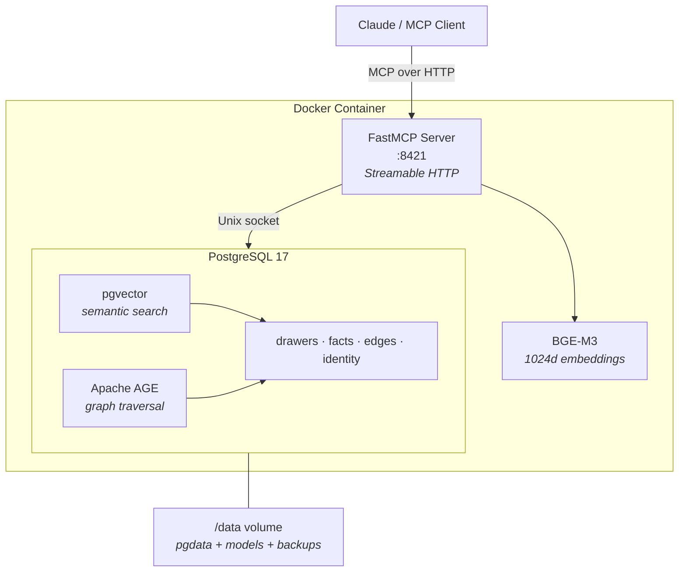

# HiveMem

Personal knowledge system with semantic search and temporal knowledge graph.

MCP server backed by PostgreSQL 17 (pgvector + Apache AGE) with BGE-M3 embeddings.

## Vision & Research

HiveMem is built on the premise that well-structured external knowledge systems are not just storage — they extend cognition. Every design decision is grounded in research on how humans process, retain, and retrieve information.

### Scientific Foundations

| Theory | Key Insight | HiveMem Consequence |
|---|---|---|
| **Working Memory Limitation** (Cowan, 2001) | Humans hold ~4 items in working memory | Wake-up context delivers max 15-20 items, prioritized by importance |
| **Cognitive Load Theory** (Sweller, 1988) | Disorganized information wastes mental resources needed for thinking | Wings/Rooms/Halls taxonomy, Maps of Content, progressive summarization |
| **Extended Mind Thesis** (Clark & Chalmers, 1998) | Well-used external tools become genuine extensions of cognition | Proactive capturing, graph traversal for hidden connections, synthesis agents |
| **Forgetting Curve** (Ebbinghaus, 1885) | 90% of learned information is lost within a week | Immediate capture at session end, proactive storage of decisions |

### PKM Frameworks

**Zettelkasten** (Luhmann) — Atomic notes + linking. Knowledge emerges from connections, not hierarchies. Luhmann produced 70 books and 400 papers from 90,000 linked notes.

*What HiveMem adopts:* Atomic drawers (one topic per drawer), knowledge graph as linking (facts, edges), cross-wing tunnels as cross-references.
*What HiveMem does differently:* No manual linking — LLM agents detect connections. Semantic search instead of manual navigation. Temporal validity — notes can expire.

**PARA** (Tiago Forte) — Projects / Areas / Resources / Archive. Sorted by actionability, not topic.

*What HiveMem adopts:* Actionability field (actionable / reference / someday / archive). Wake-up prioritizes actionable over reference. Wings map to Areas.

### References

- Cowan, N. (2001). *The magical number 4 in short-term memory.* Behavioral and Brain Sciences, 24(1), 87-114.
- Sweller, J. (1988). *Cognitive Load During Problem Solving.* Cognitive Science, 12(2), 257-285.
- Clark, A. & Chalmers, D. (1998). *The Extended Mind.* Analysis, 58(1), 7-19.
- Ebbinghaus, H. (1885). *Uber das Gedachtnis.*
- Ahrens, S. (2017). *How to Take Smart Notes.* CreateSpace.
- Forte, T. (2022). *Building a Second Brain.* Atria Books.

## Features

- 16 MCP tools (search, knowledge graph, time machine, wake-up, import, ...)
- Semantic search with BGE-M3 (1024 dims, 100+ languages, <1s queries)
- Temporal knowledge graph (valid_from/valid_until, historical queries)
- Multi-hop graph traversal (recursive CTEs / Apache AGE)
- Single container deployment (one command: `docker run`)
- Built-in backup command

## Prerequisites

- [Docker](https://docs.docker.com/get-docker/) (v20+)
- ~4 GB free disk space (BGE-M3 model ~2.2 GB + Docker image ~3.5 GB)
- ~3 GB free RAM (BGE-M3 embedding model runs on CPU)

## Installation

### 1. Clone and build

```bash
git clone https://github.com/ufelmann/HiveMem.git
cd HiveMem
docker build -t hivemem .
```

### 2. Run

```bash
docker run -d --name hivemem \
  -p 8421:8421 \
  -v hivemem_data:/data \
  --restart unless-stopped \
  hivemem
```

First start takes a few minutes — the container initializes PostgreSQL and downloads the BGE-M3 embedding model (~2.2 GB). Check progress:

```bash
docker logs -f hivemem
```

Alternatively, use Docker Compose:

```bash
docker compose up -d
```

### 3. Verify

```bash
curl -s http://localhost:8421/mcp \
  -H "Content-Type: application/json" \
  -d '{"jsonrpc":"2.0","id":1,"method":"tools/list"}' | head -c 200
```

### 4. Connect to Claude

Add to your MCP client config (Claude Desktop `claude_desktop_config.json` or Claude Code `.mcp.json`):

```json
{
  "mcpServers": {
    "hivemem": {
      "type": "http",
      "url": "http://localhost:8421/mcp",
      "headers": {
        "Authorization": "Bearer YOUR_TOKEN_HERE"
      }
    }
  }
}
```

Get your token from the container logs (see [Authentication](#authentication) section below). All 16 `hivemem_*` tools should now be available.

### 5. Seed identity (optional)

Customize `scripts/seed-identity.py` with your own profile, then:

```bash
docker exec hivemem python3 scripts/seed-identity.py
```

## Authentication

HiveMem generates a random API token on first start. Find it in the container logs:

```bash
docker logs hivemem 2>&1 | grep "API token"
```

Or retrieve it anytime:

```bash
docker exec hivemem hivemem-token
```

Add the token to your MCP client config:

```json
{
  "mcpServers": {
    "hivemem": {
      "type": "http",
      "url": "http://host:8421/mcp",
      "headers": {
        "Authorization": "Bearer YOUR_TOKEN_HERE"
      }
    }
  }
}
```

### Token Management

```bash
# Show current token
docker exec hivemem hivemem-token

# Generate new token (no restart needed)
docker exec hivemem hivemem-token regenerate

# Show database password (for debugging)
docker exec hivemem hivemem-token show-db
```

### Security Features

- **Bearer Token Auth** — every request requires `Authorization: Bearer <token>`
- **Rate Limiting** — 5 failed attempts per IP → 15 minute ban
- **Audit Log** — all requests logged to `/data/audit.log`
- **PostgreSQL Auth** — scram-sha-256, no trust auth

## Backups

```bash
docker exec hivemem hivemem-backup
```

Dumps are saved to `/data/backups/` inside the volume (gzipped, last 7 days kept). For automated daily backups, add a cron job on the host:

```bash
0 3 * * * docker exec hivemem hivemem-backup
```

## Debugging

```bash
# PostgreSQL shell
docker exec -it hivemem psql -U hivemem

# Container logs
docker logs hivemem --tail 50

# Health check
curl -s http://localhost:8421/mcp \
  -H "Content-Type: application/json" \
  -d '{"jsonrpc":"2.0","id":1,"method":"tools/call","params":{"name":"hivemem_health","arguments":{}}}'
```

## Architecture



### Tools (16)

| Category | Tools |
|---|---|
| **Read** (9) | `search` · `search_kg` · `get_drawer` · `list_wings` · `list_rooms` · `traverse` · `time_machine` · `wake_up` · `status` |
| **Write** (4) | `add_drawer` · `kg_add` · `kg_invalidate` · `update_identity` |
| **Import** (2) | `mine_file` · `mine_directory` |
| **Admin** (1) | `health` |

## License

MIT
