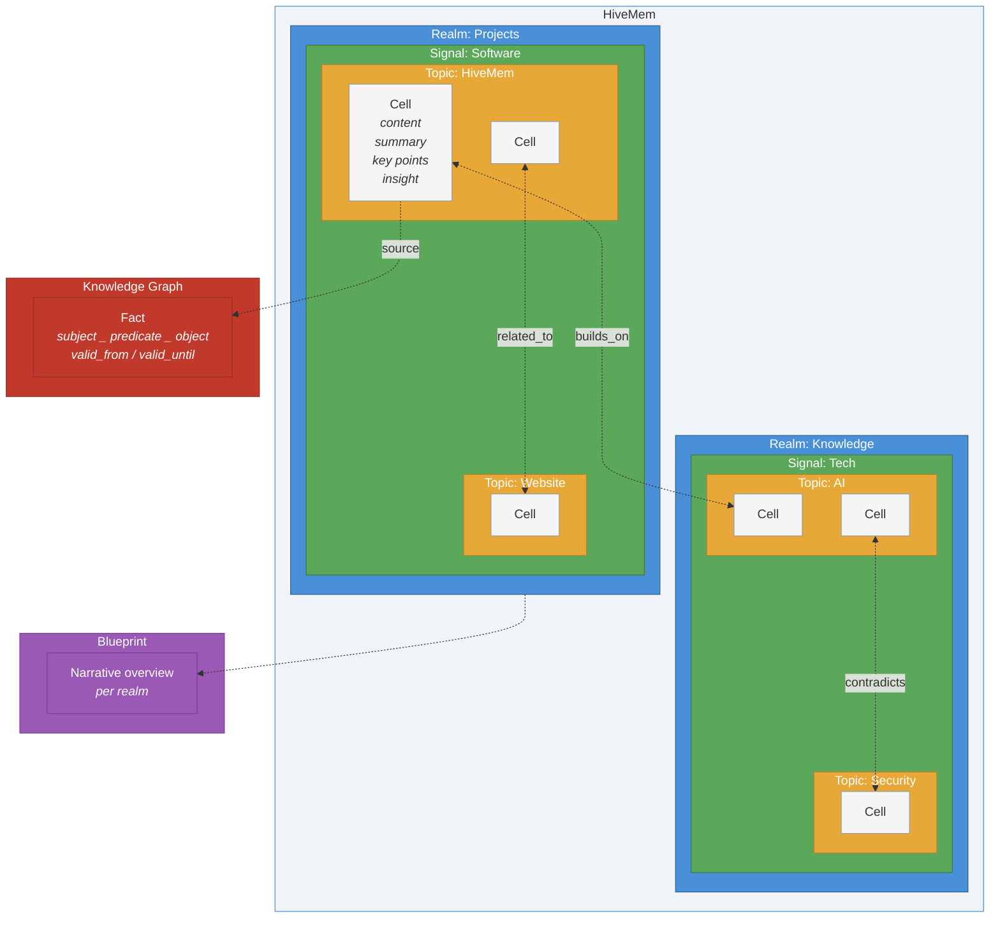
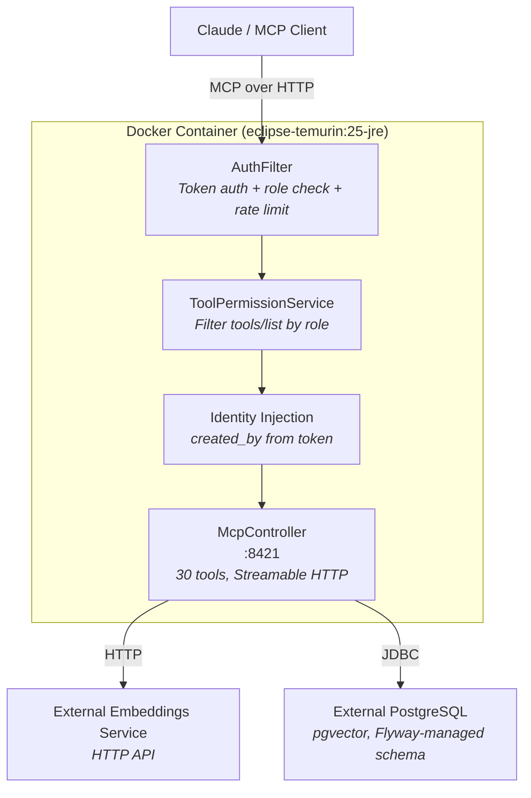
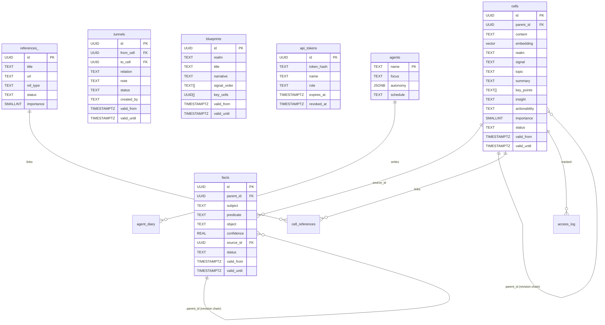

# HiveMem


Personal knowledge system with semantic search, temporal knowledge graph, and progressive summarization.

MCP server backed by PostgreSQL (pgvector) with external embeddings service. 30 tools, append-only versioning, role-based token auth, agent fleet with approval workflow.

[](https://github.com/ufelmann/HiveMem/actions/workflows/ci.yml)
[](https://codecov.io/gh/ufelmann/HiveMem)
[](https://github.com/ufelmann/HiveMem/releases)
[](https://github.com/ufelmann/HiveMem/pkgs/container/hivemem)
[](https://openjdk.org)
[](https://spring.io/projects/spring-boot)
[](https://postgresql.org)
[](https://github.com/ufelmann/HiveMem/actions/workflows/ci.yml)
[](https://github.com/ufelmann/HiveMem#tool-list-full)
[](https://github.com/ufelmann/HiveMem/blob/main/LICENSE)
[](https://safeskill.dev/scan/ufelmann-hivemem)

**Docker images:** [`ghcr.io/ufelmann/hivemem:main`](https://github.com/ufelmann/HiveMem/pkgs/container/hivemem) for the rolling `main` branch, plus semver tags such as `ghcr.io/ufelmann/hivemem:6.2.0` for cut releases.

## Vision & Research

HiveMem is built on the premise that well-structured external knowledge systems are not just storage -- they extend cognition. Every design decision is grounded in research on how humans process, retain, and retrieve information.

### Scientific Foundations

| Theory | Key Insight | HiveMem Consequence |
|---|---|---|
| **Working Memory Limitation** (Cowan, 2001) | Humans hold ~4 items in working memory | Wake-up context delivers max 15-20 items, prioritized by importance |
| **Cognitive Load Theory** (Sweller, 1988) | Disorganized information wastes mental resources needed for thinking | Realms/Signals/Topics taxonomy, Blueprints, progressive summarization |
| **Extended Mind Thesis** (Clark & Chalmers, 1998) | Well-used external tools become genuine extensions of cognition | Proactive capturing, graph traversal for hidden connections, synthesis agents |
| **Forgetting Curve** (Ebbinghaus, 1885) | 90% of learned information is lost within a week | Immediate capture at session end, proactive storage of decisions |

### PKM Frameworks

**Zettelkasten** (Luhmann) -- Atomic notes + linking. Knowledge emerges from connections, not hierarchies. Luhmann produced 70 books and 400 papers from 90,000 linked notes.

*What HiveMem adopts:* Atomic cells (one topic per cell), knowledge graph as linking (facts), cell-to-cell tunnels with temporal versioning (related_to, builds_on, contradicts, refines).
*What HiveMem does differently:* Semi-automatic linking -- LLM agents create tunnels after archiving based on semantic search. Bidirectional traversal. Temporal validity -- notes and tunnels can expire.

**PARA** (Tiago Forte) -- Projects / Areas / Resources / Archive. Sorted by actionability, not topic.

*What HiveMem adopts:* Actionability field (actionable / reference / someday / archive). Wake-up prioritizes actionable over reference. Realms map to Areas.

### References

- Cowan, N. (2001). *The magical number 4 in short-term memory.* Behavioral and Brain Sciences, 24(1), 87-114.
- Sweller, J. (1988). *Cognitive Load During Problem Solving.* Cognitive Science, 12(2), 257-285.
- Clark, A. & Chalmers, D. (1998). *The Extended Mind.* Analysis, 58(1), 7-19.
- Ebbinghaus, H. (1885). *Uber das Gedachtnis.*
- Ahrens, S. (2017). *How to Take Smart Notes.* CreateSpace.
- Forte, T. (2022). *Building a Second Brain.* Atria Books.

## Transparency & Trust

- **Privacy First:** HiveMem is 100% self-hosted. Your data never leaves your infrastructure.
- **Auditability:** All tool calls and authentication events are logged to `/data/audit.log`.
- **Security:** Built-in RBAC (Role-Based Access Control) ensures that agents can only perform actions you approve.

## Features

- **30 MCP tools** across search, knowledge graph, progressive summarization, agent fleet, references, and admin
- **6-signal ranked search** -- semantic similarity + keyword match + recency + importance + popularity + graph proximity
- **Append-only versioning** -- never lose history, revise with parent_id chains, point-in-time queries
- **Progressive summarization** -- content, summary, key_points, insight per cell
- **Temporal knowledge graph** -- facts with valid_from/valid_until, contradiction detection, multi-hop traversal
- **Role-based token auth** -- multiple tokens, 4 roles (admin/writer/reader/agent), per-role tool visibility
- **Agent fleet** with approval workflow -- agents write pending suggestions, only admins approve
- **Blueprints** -- curated narrative overviews per realm, append-only versioned
- **References & reading list** -- track sources, link to cells, filter by type/status
- **Spring Boot 4.0.5 + Java 25** -- MCP server with jOOQ, Flyway migrations, Caffeine cache
- **Automatic embedding reencoding** -- detects model changes at startup, re-encodes all vectors with backup and progress tracking
- **Comprehensive JUnit + Testcontainers suite** -- unit, integration, HTTP end-to-end, performance, security, concurrency

## Prerequisites

- [Docker](https://docs.docker.com/get-docker/) (v20+)
- An external PostgreSQL database with pgvector extension (e.g. `pgvector/pgvector:pg17`)
- An external embeddings service reachable via HTTP (see below)

## Embedding Service

HiveMem requires an external embedding service. An ONNX-based service is included in `embedding-service/` and can be configured via environment variables instead of code changes.

The service must expose:
- `POST /embeddings` — `{"text": "...", "mode": "document"}` → `{"vector": [...], "model": "...", "dimension": N}`
- `GET /info` — `{"model": "...", "dimension": N}` (used by HiveMem for model change detection)

**Automatic reencoding:** When HiveMem detects a model change at startup (different model name or dimension), it automatically backs up the database, re-encodes all cells, and rebuilds the HNSW index. Search is blocked (503) during reencoding.

Key environment variables:
- `MODEL_PATH` — mounted directory with local model files; preferred for manual installs
- `MODEL_REPO` — HF repo used when `MODEL_PATH` is unset
- `MODEL_NAME` — model identifier reported by `/info`
- `ONNX_FILE` / `TOKENIZER_FILE` — optional explicit filenames inside the model directory
- `POOLING` — `mean` or `cls`
- `MAX_LENGTH` — tokenizer truncation/padding length
- `QUERY_PREFIX` / `DOCUMENT_PREFIX` — optional retrieval prefixes

To build the embedding service:

```bash
cd embedding-service
docker build -t hivemem-embeddings .
```

## Quick Start

No clone needed. Save this as `docker-compose.yml` and run `docker compose up -d`:

```yaml
services:
  hivemem-db:
    image: pgvector/pgvector:pg17
    container_name: hivemem-db
    environment:
      POSTGRES_DB: hivemem
      POSTGRES_USER: hivemem
      POSTGRES_PASSWORD: ${HIVEMEM_DB_PASSWORD:-changeme}
    volumes:
      - hivemem-pgdata:/var/lib/postgresql/data
    networks:
      - hivemem-net
    restart: unless-stopped

  hivemem-embeddings:
    image: ghcr.io/ufelmann/hivemem-embeddings:6.3.0
    container_name: hivemem-embeddings
    volumes:
      - hivemem-embeddings-models:/app/models
    networks:
      - hivemem-net
    restart: unless-stopped

  hivemem:
    image: ghcr.io/ufelmann/hivemem:6.3.0
    container_name: hivemem
    ports:
      - "8421:8421"
    environment:
      HIVEMEM_JDBC_URL: jdbc:postgresql://hivemem-db:5432/hivemem
      HIVEMEM_DB_USER: hivemem
      HIVEMEM_DB_PASSWORD: ${HIVEMEM_DB_PASSWORD:-changeme}
      HIVEMEM_EMBEDDING_URL: http://hivemem-embeddings:80
    depends_on:
      - hivemem-db
      - hivemem-embeddings
    networks:
      - hivemem-net
    restart: unless-stopped

networks:
  hivemem-net:

volumes:
  hivemem-pgdata:
  hivemem-embeddings-models:
```

```bash
# Set a password (or it defaults to "changeme")
export HIVEMEM_DB_PASSWORD=your-secret-here

# Start everything
docker compose up -d

# Wait for startup (Flyway migrations run automatically)
docker logs -f hivemem

# Create your first API token
docker exec hivemem hivemem-token create my-admin --role admin
# Save the printed token — it's shown once and never stored
```

That's it. Three containers, all images from GHCR, no build needed.

For a pinned production rollout, use the current release tags such as `:6.3.0`. Use `:main` only if you explicitly want the rolling branch build.

### Build from source (optional)

```bash
git clone https://github.com/ufelmann/HiveMem.git
cd HiveMem
docker build -t hivemem .
```

At startup, Spring Boot runs Flyway migrations against the configured PostgreSQL database. Check progress:

```bash
docker logs -f hivemem
```

Wait for the Spring Boot startup log and a successful `/mcp` response before proceeding.

### Required Environment Variables

| Variable | Description |
|---|---|
| `HIVEMEM_JDBC_URL` | JDBC connection string (e.g. `jdbc:postgresql://postgres:5432/hivemem`) |
| `HIVEMEM_DB_USER` | PostgreSQL username |
| `HIVEMEM_DB_PASSWORD` | PostgreSQL password |
| `HIVEMEM_EMBEDDING_URL` | URL of the external embeddings service |
| `HIVEMEM_API_TOKEN` | Used by `deploy.sh` for the health-check smoke test |

### Create an API token

Use the `hivemem-token` CLI (copy it into the container first, see [Token management](#token-management) below):

```bash
docker cp scripts/hivemem-token hivemem:/usr/local/bin/hivemem-token
docker exec hivemem hivemem-token create my-admin --role admin
```

The plaintext token is printed once and never stored. Save it immediately.

### Connect to Claude Code

**CLI (recommended):**

```bash
claude mcp add --scope user hivemem --transport http http://localhost:8421/mcp \
  --header "Authorization: Bearer YOUR_TOKEN_HERE"
```

Restart Claude Code. The 30 HiveMem tools are now available in every session.

**Manual config** (`~/.claude.json` for user-level, or `.mcp.json` for project-level):

```json
{
  "mcpServers": {
    "hivemem": {
      "type": "http",
      "url": "http://localhost:8421/mcp",
      "headers": {
        "Authorization": "Bearer YOUR_TOKEN_HERE"
      }
    }
  }
}
```

### Connect to Claude Desktop

Add to `claude_desktop_config.json`:

```json
{
  "mcpServers": {
    "hivemem": {
      "type": "http",
      "url": "http://localhost:8421/mcp",
      "headers": {
        "Authorization": "Bearer YOUR_TOKEN_HERE"
      }
    }
  }
}
```

### Teach your agent to use HiveMem

The MCP server ships instructions that tell the agent *how* to use the 30 tools (call `wake_up` first, optionally pass `dedupe_threshold` to `add_cell` for duplicate detection, etc.). But the agent won't reliably *remember to archive* unless you tell it to in your own CLAUDE.md.

Add this to your **user-level** CLAUDE.md (`~/.claude/CLAUDE.md`) so it applies to every project:

```markdown
## HiveMem — Persistent Knowledge

You have a HiveMem MCP server available as your long-term memory. Use it
aggressively.

### Availability check

HiveMem tools are exposed under the `mcp__hivemem__*` namespace (e.g.
`mcp__hivemem__wake_up`, `mcp__hivemem__search`). If those tools are not
listed in the current session, skip this section entirely — do not mention
HiveMem, do not apologize for its absence.

### Session start (HARD RULE)

Call `wake_up` BEFORE your first response, BEFORE any other tool call,
BEFORE reading any file. No exceptions beyond the availability check above.

### During conversation — search proactively

Wake_up is a snapshot, not a subscription. Search actively on these signals:

- **Named reference.** User mentions a named project, person, decision, tool,
  or system not in wake_up → `search` BEFORE answering. Even if you
  think you remember.
- **Temporal reference.** "last week", "a while back", "we decided earlier",
  "remember when" → `search` with keywords, or `time_machine`
  for point-in-time queries.
- **Uncertainty.** About to say "I'm not sure" or hedge? Search FIRST. Only
  hedge if the search returns nothing.
- **Topic drift.** Conversation shifts to a new area not in wake_up → quick
  `search` before engaging.
- **Entity-specific.** User asks about a specific entity → `quick_facts`
  for facts, `search_kg` for relationships.

**Anti-patterns — do NOT:**
- Hedge instead of searching ("I think we discussed...")
- Answer from wake_up when the topic wasn't in wake_up
- Batch searches for session end
- Wait for the user to prompt you

One `search` is cheap. Answering wrong is expensive.

### During work

After any significant action (bug fix, feature, design decision, deployment,
investigation), archive immediately — do not batch, do not wait.

Archiving:
1. `add_cell` with `dedupe_threshold: 0.92`
2. `kg_add` for each fact with `on_conflict=return` and `valid_from` set
3. `search` for related cells, then `add_tunnel` for the top
   2-3 matches

When a fact changes: `kg_invalidate` the old one FIRST, then
`kg_add` the new one.

### Session end

Archive anything significant not yet stored. When the user says "archive",
"save", or "persist": archive the full session.

### Classification

Realm = life/work area. Signal = nature of knowledge. Topic = specific subject.

Call `list` before inventing new realms — it navigates the
Realm→Signal→Topic→Cell hierarchy (omit all params for realms, add `realm` for
signals, add `realm`+`signal` for topics).

**Signals:** `facts` | `events` | `discoveries` | `preferences` | `advice`

Fill `content`, `summary`, `key_points`, and `insight` (when there is a
non-obvious takeaway). Every fact needs `valid_from`.

### What to archive
- Decisions + the "why" (not just the "what")
- Discoveries, surprises, lessons learned
- Infrastructure / deployment changes
- Bug root causes + fixes
- New patterns, conventions, processes

### What NOT to archive
- Routine code changes obvious from git history
- Temporary debugging steps
- Information already in project CLAUDE.md or README

### Precedence

Project-local CLAUDE.md overrides these rules if it says otherwise.
```

**Why user-level?** Project-level CLAUDE.md files describe the *project*. HiveMem is *your* memory across all projects. A user-level CLAUDE.md ensures every agent, in every repo, knows to persist knowledge — even in repos that have never heard of HiveMem.

**Why is the MCP protocol not enough?** The MCP `instructions` field tells the agent *how* to use the tools correctly (check duplicates, fill all layers, etc.). But it cannot force the agent to *decide* to archive — that decision depends on the conversation context, which only the CLAUDE.md can influence. The MCP protocol is the "API docs"; the CLAUDE.md is the "job description".

## The Structure

HiveMem organizes knowledge in a spatial hierarchy that is easy to navigate. Realms, signals, topics, and cells -- four levels from broad to specific. Tunnels connect cells across the entire structure, revealing hidden relationships in your knowledge.



### Concepts

| Concept | Description | Example |
|---|---|---|
| **Realm** | Top-level category | "Projects", "Knowledge", "Cooking" |
| **Signal** | A signal within a realm | "Software", "Italian Cuisine" |
| **Topic** | A topic within a signal | "HiveMem", "Pasta Recipes" |
| **Cell** | Single knowledge item with content, summary, key points, and insight | A design decision, a recipe, a meeting note |
| **Tunnel** | Passage connecting two cells | `builds_on`, `related_to`, `contradicts`, `refines` |
| **Fact** | Atomic knowledge triple in the knowledge graph | "HiveMem → uses → PostgreSQL" with temporal validity |
| **Blueprint** | Narrative overview of a realm | How signals, topics, and key cells in a realm connect |

### How it works

1. **Store** -- Content is classified into realm/signal/topic and stored as a cell with progressive summarization (content, summary, key points, insight)
2. **Connect** -- Tunnels link related cells across the structure; facts capture atomic relationships in the knowledge graph
3. **Search** -- 6-signal ranked search finds cells by meaning, keywords, recency, importance, popularity, and graph proximity
4. **Traverse** -- Follow tunnels to discover hidden connections; use time machine to see what was known at any point
5. **Wake up** -- Each session starts with identity context and critical facts, like navigating back to your knowledge and remembering where everything is

## Architecture



### Data Model



### Security & Capability Matrix

Every HiveMem tool is mapped to a specific role to ensure least privilege. Write operations (excluding agents) and admin functions are protected by RBAC.

| Category | Tools | Access Role | Data Flow | HITL Required? | Description |
|---|---|---|---|---|---|
| **Search** | `search`, `search_kg`, `quick_facts`, `time_machine` | `reader` | Read Only | No | 6-signal semantic & keyword search. |
| **Read** | `status`, `get_cell`, `list_realms`, `traverse`, `wake_up`, `get_blueprint`, `history` | `reader` | Read Only | No | Navigation and context retrieval. |
| **Write** | `add_cell`, `kg_add`, `kg_invalidate`, `revise_cell`, `revise_fact`, `update_identity`, `update_blueprint` | `agent` | Propose Change | Yes (for Agents) | Append-only knowledge capture. |
| **Tunnels** | `add_tunnel`, `remove_tunnel` | `agent` | Link Discovery | Yes | Cell-to-cell semantic linking. |
| **Approval** | `approve_pending` | `admin` | Commit Change | Yes | Batch approve or reject pending agent writes. |
| **Agent** | `register_agent`, `list_agents`, `diary_write`, `diary_read` | `admin` | Fleet Management | Yes | Autonomous fleet orchestration. |
| **References** | `add_reference`, `link_reference`, `reading_list` | `agent` | Metadata | No | Source and citation tracking. |
| **Admin** | `health` | `admin` | System Management | Yes | DB connection, extensions, counts, disk. |

### Configuration

| Variable | Default | Description |
|---|---|---|
| `HIVEMEM_JDBC_URL` | (required) | JDBC connection string to PostgreSQL |
| `HIVEMEM_DB_USER` | (required) | PostgreSQL username |
| `HIVEMEM_DB_PASSWORD` | (required) | PostgreSQL password |
| `HIVEMEM_EMBEDDING_URL` | `http://localhost:8081` | URL of the external embeddings service |
| `HIVEMEM_EMBEDDING_TIMEOUT` | `PT5S` | HTTP timeout for embedding requests (ISO 8601 duration) |
| `SERVER_PORT` | `8421` | Port for the MCP server |

### Security & Compliance

- **SafeSkill Score:** **100/100 (Verified Safe)**. See [SafeSkill Report](https://safeskill.dev/scan/ufelmann-hivemem).
- **Transparency:** 7/7 points. See [SAFE.md](SAFE.md) for the security manifest.
- **Audit Logging:** Every tool call is logged in JSON to `/data/audit.log`.
- **Human-in-the-Loop:** All agent writes require manual approval via `approve_pending`.

### Tool List (Full)

**Read (15):**

1. `status`: System overview and counts.
2. `search`: Semantic similarity + keyword search; returns metadata by default and supports `include` for optional fields.
3. `search_kg`: Knowledge graph triple lookup.
4. `get_cell`: Read a single knowledge item (logs access automatically); supports `include` for optional fields including content.
5. `list`: Navigate the Realm→Signal→Topic→Cell hierarchy (omit all params for realms; add `realm` for signals; add `realm`+`signal` for topics; add `realm`+`signal`+`topic` for cells).
6. `traverse`: Recursive graph traversal.
7. `quick_facts`: Context-aware facts about an entity.
8. `time_machine`: Historical knowledge retrieval.
9. `wake_up`: Initial session context.
10. `history`: Trace revisions of a cell or fact (type-dispatched, recursive CTE depth cap 100).
11. `pending_approvals`: List work awaiting review.
12. `get_blueprint`: Narrative realm overviews.
13. `reading_list`: Manage unread/in-progress sources.
14. `list_agents`: View active agent fleet.
15. `diary_read`: Read agent diary entries.

**Write (13):**

16. `add_cell`: Store a cell with content, summary, key points, and insight; optional `dedupe_threshold` runs an embedding-based dedupe gate in one call.
17. `add_tunnel`: Link two cells together.
18. `kg_add`: Fact triple; optional `on_conflict` (`insert`|`return`|`reject`) gates against active conflicts.
19. `kg_invalidate`: Soft-delete/expire a fact.
20. `update_identity`: Update session context facts.
21. `add_reference`: Store source documents/URLs.
22. `link_reference`: Cite source for a cell.
23. `remove_tunnel`: Expire a cell link.
24. `revise_cell`: Create a new version of a cell.
25. `revise_fact`: Create a new version of a fact.
26. `register_agent`: Add an agent to the fleet.
27. `diary_write`: Agent-private reflection tool.
28. `update_blueprint`: Update realm narrative.

**Admin (2):**

29. `approve_pending`: Admin tool to batch approve or reject agent writes.
30. `health`: Monitor DB and service state.

### Search Signals

The `search` tool combines 6 signals with configurable weights:

| Signal | Default Weight | Description |
|---|---|---|
| Semantic | 0.30 | Vector cosine similarity |
| Keyword | 0.15 | PostgreSQL full-text search (tsvector, BM25-like) |
| Recency | 0.15 | Exponential decay, 90-day half-life |
| Importance | 0.15 | User/agent assigned 1-5 scale |
| Popularity | 0.15 | Access frequency (materialized view) |
| Graph proximity | 0.10 | Boost for cells reachable from the top semantic candidates via tunnels (depth ≤ 2). Per-relation weights default to `builds_on=1.0`, `refines=0.8`, `related_to=0.6`, `contradicts=0.4`. |

Weights are configurable via `hivemem.search.weights` in `application.yml` and per-call via the MCP `search` arguments (`weight_semantic`, `weight_keyword`, `weight_recency`, `weight_importance`, `weight_popularity`, `weight_graph_proximity`).

`search` defaults to `summary`, `tags`, `importance`, and `created_at` plus required identity fields (`id`, `realm`, `signal`, `topic`). `get_cell` defaults to `summary`, `key_points`, `insight`, `tags`, `importance`, `source`, and `created_at` plus the same required identity fields. Pass `include` to request a specific subset of optional fields, including `content`.

### Progressive Summarization

Every cell supports four progressive fields:

| Field | Purpose |
|---|---|
| `content` | Full verbatim text |
| `summary` | One-sentence summary for scanning |
| `key_points` | 3-5 core takeaways |
| `insight` | Personal conclusion / implication |

Plus `actionability` (actionable / reference / someday / archive) and `importance` (1-5).

## Authentication & Authorization

Tokens are stored as SHA-256 hashes in PostgreSQL. The plaintext is shown exactly once at creation and never stored. Auth responses are cached with Caffeine (60s TTL, max 1000 entries).

### Roles

Each token has one of four roles. The role controls which tools the client sees in `tools/list` and which it can call.

| Role | Visible tools | Write behavior | Can approve? |
|---|---|---|---|
| `admin` | All 30 | `status: committed` | Yes |
| `writer` | 28 (no admin tools) | `status: committed` | No |
| `reader` | 15 (read only) | Can't write | No |
| `agent` | 28 (same as writer) | `status: pending` | No |

The `agent` role is the key constraint: agents can add knowledge, but every write goes into a pending queue. Only an admin can approve or reject it. This prevents any agent from writing and self-approving in the same session.

`created_by` is set automatically from the token name. Clients can't override it.

### Token management

The `hivemem-token` CLI is included in the Docker image:

```bash
docker exec hivemem hivemem-token create <name> --role admin|writer|reader|agent [--expires 90d]
```

Available commands (when the script is available):

```bash
hivemem-token create <name> --role admin|writer|reader|agent [--expires 90d]
hivemem-token list
hivemem-token revoke <name>
hivemem-token info <name>
```

### Security details

- **Rate limiting** -- 5 failed auth attempts per IP triggers a 15-minute ban
- **Audit log** -- every request logged to `/data/audit.log`
- **Timing-safe** -- token comparison uses SHA-256 hash lookup, not string comparison
- **Path traversal protection** -- file import restricted to `/data/imports` and `/tmp`
- **Tool call enforcement** -- `tools/call` checked against role permissions, not just `tools/list` filtering

## Backups

The `hivemem-backup` script is included in the Docker image. It is also called automatically before embedding reencoding.

```bash
# Manual backup (adjust container name if needed)
docker exec hivemem-db pg_dump -U hivemem hivemem | gzip > "hivemem-$(date +%Y%m%d).sql.gz"
```

To automate daily backups:

```bash
# crontab -e
45 1 * * * docker exec hivemem-db pg_dump -U hivemem hivemem | gzip > /path/to/backups/hivemem-$(date +\%Y\%m\%d).sql.gz

## Development

### Run tests (no deployment needed)

Tests use [Testcontainers](https://java.testcontainers.org/) -- a `pgvector/pgvector:pg17` container is started and destroyed per session. Embeddings are stubbed with a fixed test client (deterministic vectors, no external service needed).

```bash
cd java-server
mvn test
```

The exact test count changes over time; use the CI badge and workflow runs above as the current source of truth.

### Deploy changes

```bash
# Set required env vars first:
export HIVEMEM_JDBC_URL=jdbc:postgresql://postgres:5432/hivemem
export HIVEMEM_DB_USER=hivemem
export HIVEMEM_DB_PASSWORD=secret
export HIVEMEM_EMBEDDING_URL=http://embeddings:8081
export HIVEMEM_API_TOKEN=your-admin-token

./deploy.sh java
```

The script builds the Docker image, restarts the container, and waits for a successful health check on `/mcp`.

### Migrations

Schema changes are managed by [Flyway](https://flywaydb.org/). Migrations run automatically at Spring Boot application startup.

Migration files live in `java-server/src/main/resources/db/migration/` using the Flyway naming convention (`V0001__description.sql`, `V0002__description.sql`, etc.).

To add a new migration:

```bash
cat > java-server/src/main/resources/db/migration/V0009__my_feature.sql << 'EOF'
CREATE TABLE IF NOT EXISTS my_table (...);
EOF
```

Deploy the application -- Flyway applies pending migrations on startup.

### Debugging

```bash
docker logs hivemem --tail 50  # Container logs
```

## License

HiveMem is fair-code licensed under the [Sustainable Use License](LICENSE).

- **Free** for personal use and internal business use
- **Source available** -- inspect, modify, learn
- **Commercially restricted** -- you can't sell HiveMem as a service

See [LICENSING.md](LICENSING.md) for plain-English details and examples.
