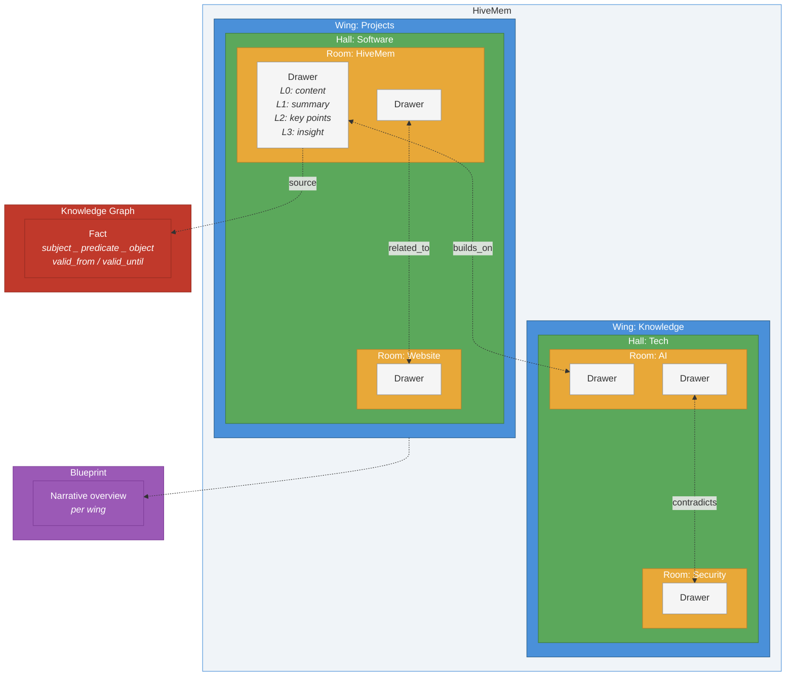
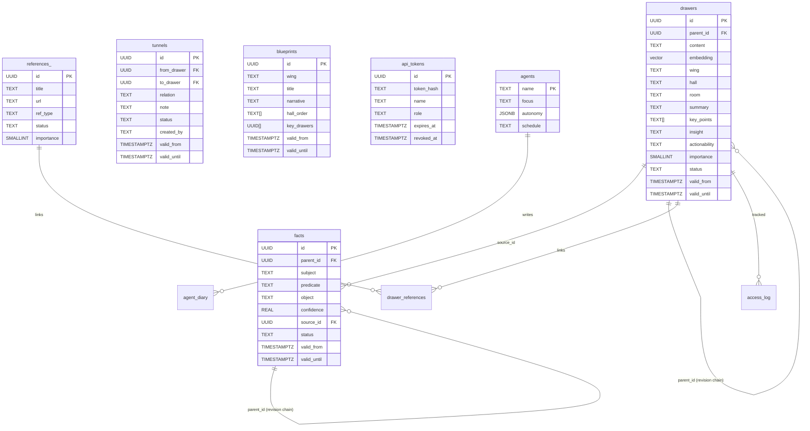

# HiveMem

Personal knowledge system with semantic search, temporal knowledge graph, and progressive summarization.

MCP server backed by PostgreSQL 17 (pgvector + Apache AGE) with BGE-M3 embeddings. 36 tools, append-only versioning, role-based token auth, agent fleet with approval workflow.

[](https://github.com/ufelmann/HiveMem/actions/workflows/ci.yml)
[](https://codecov.io/gh/ufelmann/HiveMem)
[](https://github.com/ufelmann/HiveMem/releases)
[](https://github.com/ufelmann/HiveMem/pkgs/container/hivemem)
[](https://python.org)
[](https://postgresql.org)
[](https://github.com/ufelmann/HiveMem#tools-36)
[](https://github.com/ufelmann/HiveMem/blob/main/LICENSE)
[](https://safeskill.dev/scan/ufelmann-hivemem)

**Docker image:** [`ghcr.io/ufelmann/hivemem:main`](https://github.com/ufelmann/HiveMem/pkgs/container/hivemem)

## Vision & Research

HiveMem is built on the premise that well-structured external knowledge systems are not just storage -- they extend cognition. Every design decision is grounded in research on how humans process, retain, and retrieve information.

### Scientific Foundations

| Theory | Key Insight | HiveMem Consequence |
|---|---|---|
| **Working Memory Limitation** (Cowan, 2001) | Humans hold ~4 items in working memory | Wake-up context delivers max 15-20 items, prioritized by importance |
| **Cognitive Load Theory** (Sweller, 1988) | Disorganized information wastes mental resources needed for thinking | Wings/Halls/Rooms taxonomy, Blueprints, progressive summarization |
| **Extended Mind Thesis** (Clark & Chalmers, 1998) | Well-used external tools become genuine extensions of cognition | Proactive capturing, graph traversal for hidden connections, synthesis agents |
| **Forgetting Curve** (Ebbinghaus, 1885) | 90% of learned information is lost within a week | Immediate capture at session end, proactive storage of decisions |

### PKM Frameworks

**Zettelkasten** (Luhmann) -- Atomic notes + linking. Knowledge emerges from connections, not hierarchies. Luhmann produced 70 books and 400 papers from 90,000 linked notes.

*What HiveMem adopts:* Atomic drawers (one topic per drawer), knowledge graph as linking (facts), drawer-to-drawer tunnels with temporal versioning (related_to, builds_on, contradicts, refines).
*What HiveMem does differently:* Semi-automatic linking -- LLM agents create tunnels after archiving based on semantic search. Bidirectional traversal. Temporal validity -- notes and tunnels can expire.

**PARA** (Tiago Forte) -- Projects / Areas / Resources / Archive. Sorted by actionability, not topic.

*What HiveMem adopts:* Actionability field (actionable / reference / someday / archive). Wake-up prioritizes actionable over reference. Wings map to Areas.

### References

- Cowan, N. (2001). *The magical number 4 in short-term memory.* Behavioral and Brain Sciences, 24(1), 87-114.
- Sweller, J. (1988). *Cognitive Load During Problem Solving.* Cognitive Science, 12(2), 257-285.
- Clark, A. & Chalmers, D. (1998). *The Extended Mind.* Analysis, 58(1), 7-19.
- Ebbinghaus, H. (1885). *Uber das Gedachtnis.*
- Ahrens, S. (2017). *How to Take Smart Notes.* CreateSpace.
- Forte, T. (2022). *Building a Second Brain.* Atria Books.

## Transparency & Trust

- **Privacy First:** HiveMem is 100% self-hosted. Your data never leaves your infrastructure.
- **Local AI:** Embeddings are generated locally. Internet access is only required for the initial model download from Hugging Face.
- **Auditability:** All tool calls and authentication events are logged to `/data/audit.log`.
- **Security:** Built-in RBAC (Role-Based Access Control) ensures that agents can only perform actions you approve.

## Features

- **36 MCP tools** across search, knowledge graph, progressive summarization, agent fleet, references, and admin
- **5-signal ranked search** -- semantic similarity + keyword match + recency + importance + popularity
- **Append-only versioning** -- never lose history, revise with parent_id chains, point-in-time queries
- **Progressive summarization** (L0-L3) -- content, summary, key_points, insight per drawer
- **Temporal knowledge graph** -- facts with valid_from/valid_until, contradiction detection, multi-hop traversal
- **Role-based token auth** -- multiple tokens, 4 roles (admin/writer/reader/agent), per-role tool visibility
- **Agent fleet** with approval workflow -- agents write pending suggestions, only admins approve
- **Blueprints** -- curated narrative overviews per wing, append-only versioned
- **References & reading list** -- track sources, link to drawers, filter by type/status
- **Single container deployment** -- PostgreSQL + MCP server in one `docker run`
- **216 tests** with testcontainers -- unit, integration, HTTP end-to-end, performance, security, concurrency

## Prerequisites

- [Docker](https://docs.docker.com/get-docker/) (v20+)
- ~2 GB free disk space (Multilingual MiniLM model ~420 MB + Docker image ~1.5 GB)
- ~1 GB free RAM (SentenceTransformers model runs on CPU)

## Quick Start

### Option A: Pre-built image (recommended)

```bash
docker run -d --name hivemem \
  -p 8421:8421 \
  -v hivemem_data:/data \
  -v hivemem_models:/data/models \
  --security-opt apparmor=unconfined \
  --restart unless-stopped \
  ghcr.io/ufelmann/hivemem:main
```

### Option B: Build from source

```bash
git clone https://github.com/ufelmann/HiveMem.git
cd HiveMem
docker build -f Dockerfile.base -t hivemem-base .  # once (~20 min)
docker build -t hivemem .                           # fast (~5s)
docker run -d --name hivemem \
  -p 8421:8421 \
  -v hivemem_data:/data \
  -v hivemem_models:/data/models \
  --security-opt apparmor=unconfined \
  --restart unless-stopped \
  hivemem
```

### Option C: Docker Compose

```yaml
services:
  hivemem:
    image: ghcr.io/ufelmann/hivemem:main
    container_name: hivemem
    ports:
      - "8421:8421"
    volumes:
      - hivemem_data:/data
      - hivemem_models:/data/models
    security_opt:
      - apparmor=unconfined
    restart: unless-stopped

volumes:
  hivemem_data:
    name: hivemem_data
  hivemem_models:
    name: hivemem_models
```

```bash
docker compose up -d
```

First start initializes PostgreSQL and downloads the BGE-M3 embedding model (~2.2 GB). This takes 1-2 minutes. Check progress:

```bash
docker logs -f hivemem
```

Wait for `Uvicorn running on http://0.0.0.0:8421` before proceeding.

### Create an API token

```bash
docker exec hivemem hivemem-token create my-admin --role admin
```

Save the token -- it is shown once and cannot be retrieved.

```bash
# More token examples
docker exec hivemem hivemem-token create dashboard --role reader   # read-only (17 tools)
docker exec hivemem hivemem-token create archivarius --role agent  # writes go to pending
docker exec hivemem hivemem-token list
docker exec hivemem hivemem-token revoke dashboard
```

### Connect to Claude Code

**CLI (recommended):**

```bash
claude mcp add --scope user hivemem --transport http http://localhost:8421/mcp \
  --header "Authorization: Bearer YOUR_TOKEN_HERE"
```

Restart Claude Code. The 36 HiveMem tools are now available in every session.

**Manual config** (`~/.claude.json` for user-level, or `.mcp.json` for project-level):

```json
{
  "mcpServers": {
    "hivemem": {
      "type": "http",
      "url": "http://localhost:8421/mcp",
      "headers": {
        "Authorization": "Bearer YOUR_TOKEN_HERE"
      }
    }
  }
}
```

### Connect to Claude Desktop

Add to `claude_desktop_config.json`:

```json
{
  "mcpServers": {
    "hivemem": {
      "type": "http",
      "url": "http://localhost:8421/mcp",
      "headers": {
        "Authorization": "Bearer YOUR_TOKEN_HERE"
      }
    }
  }
}
```

### Seed identity (optional)

Customize `scripts/seed-identity.py` with your own profile, then:

```bash
docker exec hivemem python3 scripts/seed-identity.py
```

### Teach your agent to use HiveMem

The MCP server ships instructions that tell the agent *how* to use the 36 tools (call `wake_up` first, check duplicates before adding, etc.). But the agent won't reliably *remember to archive* unless you tell it to in your own CLAUDE.md.

Add this to your **user-level** CLAUDE.md (`~/.claude/CLAUDE.md`) so it applies to every project:

```markdown
## HiveMem — Persistent Knowledge

You have access to HiveMem via MCP. It is your long-term memory. Use it.

### Session start
- Call `hivemem_wake_up` before your first response. No exceptions.
- If the user asks about past work, decisions, or people: `hivemem_search` first, never guess.

### During work
- After completing a significant action (bug fix, feature, design decision, deployment, investigation):
  archive it immediately. Do not batch, do not wait for session end.
- Archiving means: `check_duplicate` → `add_drawer` (all L0-L3 layers) → extract facts (`check_contradiction` → `kg_add`) → link related drawers (`search` → `add_tunnel` for top 2-3 matches).
- When facts change: `kg_invalidate` the old fact first, then `kg_add` the new one.

### Session end
- Before the session ends, archive anything significant that hasn't been stored yet.
- When the user says "archive", "save", or "persist": archive the full session.

### Classification
- Use existing wings and halls. Call `list_wings`/`list_halls` before inventing new ones.
- Wing = major life area, Hall = broad category, Room = specific topic.
- One drawer per topic. Fill ALL layers: content (L0), summary (L1), key_points (L2), insight (L3).
- Every fact needs `valid_from`. Knowledge without timestamps is useless.

### What to archive
- Decisions and their rationale (the "why", not just the "what")
- Discoveries, surprises, lessons learned
- Infrastructure changes, deployment details
- Bug root causes and fixes
- New patterns, conventions, or processes established

### What NOT to archive
- Routine code changes that are obvious from git history
- Temporary debugging steps
- Information already in the project's CLAUDE.md or README
```

**Why user-level?** Project-level CLAUDE.md files describe the *project*. HiveMem is *your* memory across all projects. A user-level CLAUDE.md ensures every agent, in every repo, knows to persist knowledge — even in repos that have never heard of HiveMem.

**Why is the MCP protocol not enough?** The MCP `instructions` field tells the agent *how* to use the tools correctly (check duplicates, fill all layers, etc.). But it cannot force the agent to *decide* to archive — that decision depends on the conversation context, which only the CLAUDE.md can influence. The MCP protocol is the "API docs"; the CLAUDE.md is the "job description".

## The Building

HiveMem organizes knowledge like a building you walk through. Wings, halls, rooms, and drawers -- a spatial hierarchy everyone understands intuitively. Secret tunnels connect drawers across the entire structure, revealing hidden relationships in your knowledge.



### Concepts

| Concept | Description | Example |
|---|---|---|
| **Wing** | Top-level category -- a wing of the building | "Projects", "Knowledge", "Cooking" |
| **Hall** | A hall within a wing | "Software", "Italian Cuisine" |
| **Room** | A room within a hall | "HiveMem", "Pasta Recipes" |
| **Drawer** | Single knowledge item with 4 layers (L0-L3) | A design decision, a recipe, a meeting note |
| **Tunnel** | Secret passage connecting two drawers | `builds_on`, `related_to`, `contradicts`, `refines` |
| **Fact** | Atomic knowledge triple in the knowledge graph | "HiveMem → uses → PostgreSQL" with temporal validity |
| **Blueprint** | Narrative overview of a wing | How halls, rooms, and key drawers in a wing connect |

### How it works

1. **Store** -- Content is classified into wing/hall/room and stored as a drawer with progressive summarization (L0: full content, L1: summary, L2: key points, L3: insight)
2. **Connect** -- Tunnels link related drawers across the building; facts capture atomic relationships in the knowledge graph
3. **Search** -- 5-signal ranked search finds drawers by meaning, keywords, recency, importance, and popularity
4. **Traverse** -- Follow tunnels to discover hidden connections; use time machine to see what was known at any point
5. **Wake up** -- Each session starts with identity context and critical facts, like walking back into the building and remembering where everything is

## Architecture


### Data Model



### Security & Capability Matrix

Every HiveMem tool is mapped to a specific role to ensure least privilege. Write operations (excluding agents) and admin functions are protected by RBAC.

| Category | Tools | Access Role | Data Flow | HITL Required? | Description |
|---|---|---|---|---|---|
| **Search** | `search`, `search_kg`, `quick_facts`, `time_machine` | `reader` | Read Only | No | 5-signal semantic & keyword search. |
| **Read** | `status`, `get_drawer`, `list_wings`, `list_halls`, `traverse`, `wake_up`, `get_blueprint` | `reader` | Read Only | No | Navigation and context retrieval. |
| **Write** | `add_drawer`, `kg_add`, `kg_invalidate`, `revise_drawer`, `revise_fact`, `update_identity`, `update_blueprint` | `agent` | Propose Change | Yes (for Agents) | Append-only knowledge capture. |
| **Tunnels** | `add_tunnel`, `remove_tunnel` | `agent` | Link Discovery | Yes | Drawer-to-drawer semantic linking. |
| **Integrity** | `check_duplicate`, `check_contradiction`, `approve_pending` | `admin` | Commit Change | Yes | Verification and commit workflow. |
| **Agent** | `register_agent`, `list_agents`, `diary_write`, `diary_read` | `admin` | Fleet Management | Yes | Autonomous fleet orchestration. |
| **References** | `add_reference`, `link_reference`, `reading_list` | `agent` | Metadata | No | Source and citation tracking. |
| **Admin** | `health`, `log_access`, `refresh_popularity` | `admin` | System Management | Yes | Audit and performance monitoring. |

### Configuration

HiveMem is highly configurable via environment variables.

| Variable | Default | Description |
|---|---|---|
| `HIVEMEM_EMBEDDING_MODEL` | `sentence-transformers/paraphrase-multilingual-MiniLM-L12-v2` | Hugging Face model ID. Supports any SentenceTransformer or BGE model. |
| `HIVEMEM_PORT` | `8421` | Port for the MCP server. |
| `PGDATA` | `/data/pgdata` | Path to PostgreSQL data directory. |
| `HF_HUB_OFFLINE` | `0` | Set to `1` to disable all outbound requests (requires pre-cached models). |

#### Switching Models

You can switch the embedding model at any time by setting `HIVEMEM_EMBEDDING_MODEL`.

**Example: Upgrade to BGE-M3 (High-End)**
```bash
docker run -d --name hivemem \
  -e HIVEMEM_EMBEDDING_MODEL="BAAI/bge-m3" \
  -p 8421:8421 \
  -v hivemem_data:/data \
  ghcr.io/ufelmann/hivemem:main
```

**Important:** If you change the model after storing data, you **must** recompute the embeddings to match the new vector dimensions:
```bash
docker exec hivemem python3 -m hivemem.recompute_embeddings
```

### Security & Compliance

- **SafeSkill Score:** **100/100 (Verified Safe)**. See [SafeSkill Report](https://safeskill.dev/scan/ufelmann-hivemem).
- **Transparency:** 7/7 points. See [SAFE.md](SAFE.md) for the security manifest.
- **Audit Logging:** Every tool call is logged in JSON to `/data/audit.log`.
- **Human-in-the-Loop:** All agent writes require manual approval via `hivemem_approve_pending`.

### Tool List (Full)

1. `hivemem_search`: Semantic similarity + keyword search.
2. `hivemem_search_kg`: Knowledge graph triple lookup.
3. `hivemem_quick_facts`: Context-aware facts about an entity.
4. `hivemem_time_machine`: Historical knowledge retrieval.
5. `hivemem_status`: System overview and counts.
6. `hivemem_get_drawer`: Read single knowledge item.
7. `hivemem_list_wings`: List top-level categories.
8. `hivemem_list_halls`: List mid-level categories.
9. `hivemem_traverse`: Recursive graph traversal.
10. `hivemem_wake_up`: Initial session context.
11. `hivemem_get_blueprint`: Narrative wing overviews.
12. `hivemem_add_drawer`: Store L0-L3 knowledge layers.
13. `hivemem_kg_add`: Create a new fact triple.
14. `hivemem_kg_invalidate`: Soft-delete/expire a fact.
15. `hivemem_revise_drawer`: Create a new version of a drawer.
16. `hivemem_revise_fact`: Create a new version of a fact.
17. `hivemem_update_identity`: Update session context facts.
18. `hivemem_update_blueprint`: Update wing narrative.
19. `hivemem_add_tunnel`: Link two drawers together.
20. `hivemem_remove_tunnel`: Expire a drawer link.
21. `hivemem_check_duplicate`: Verify knowledge doesn't exist.
22. `hivemem_check_contradiction`: Detect logic conflicts in KG.
23. `hivemem_approve_pending`: Admin tool to commit agent work.
24. `hivemem_drawer_history`: Trace revisions of a drawer.
25. `hivemem_fact_history`: Trace revisions of a fact.
26. `hivemem_pending_approvals`: List work awaiting review.
27. `hivemem_add_reference`: Store source documents/URLs.
28. `hivemem_link_reference`: Cite source for a drawer.
29. `hivemem_reading_list`: Manage unread/in-progress sources.
30. `hivemem_register_agent`: Add an agent to the fleet.
31. `hivemem_list_agents`: View active agent fleet.
32. `hivemem_diary_write`: Agent-private reflection tool.
33. `hivemem_diary_read`: Admin tool to read agent diaries.
34. `hivemem_health`: Monitor DB and model state.
35. `hivemem_log_access`: Popularity signal ingestion.
36. `hivemem_refresh_popularity`: Update search signal cache.

### Search Signals

The `hivemem_search` tool combines 5 signals with configurable weights:

| Signal | Default Weight | Description |
|---|---|---|
| Semantic | 0.35 | Vector cosine similarity (MiniLM-L12, 384d) |
| Keyword | 0.15 | PostgreSQL full-text search (tsvector, BM25-like) |
| Recency | 0.20 | Exponential decay, 90-day half-life |
| Importance | 0.15 | User/agent assigned 1-5 scale |
| Popularity | 0.15 | Access frequency (materialized view) |

### Progressive Summarization

Every drawer supports 4 layers of progressive summarization:

| Layer | Field | Purpose |
|---|---|---|
| L0 | `content` | Full verbatim text |
| L1 | `summary` | One-sentence summary for scanning |
| L2 | `key_points` | 3-5 core takeaways |
| L3 | `insight` | Personal conclusion / implication |

Plus `actionability` (actionable / reference / someday / archive) and `importance` (1-5).

## Authentication & Authorization

Tokens are stored as SHA-256 hashes in PostgreSQL. The plaintext is shown exactly once at creation and never stored. Auth responses are cached for 60 seconds (LRU, max 1000 entries).

### Roles

Each token has one of four roles. The role controls which tools the client sees in `tools/list` and which it can call.

| Role | Visible tools | Write behavior | Can approve? |
|---|---|---|---|
| `admin` | All 36 | `status: committed` | Yes |
| `writer` | 34 (no admin tools) | `status: committed` | No |
| `reader` | 17 (read only) | Can't write | No |
| `agent` | 34 (same as writer) | `status: pending` | No |

The `agent` role is the key constraint: agents can add knowledge, but every write goes into a pending queue. Only an admin can approve or reject it. This prevents any agent from writing and self-approving in the same session.

`created_by` is set automatically from the token name. Clients can't override it.

### Token management

```bash
hivemem-token create <name> --role admin|writer|reader|agent [--expires 90d]
hivemem-token list
hivemem-token revoke <name>
hivemem-token info <name>
```

All commands run inside the container: `docker exec hivemem hivemem-token ...`

### Security details

- **Rate limiting** -- 5 failed auth attempts per IP triggers a 15-minute ban
- **Audit log** -- every request logged to `/data/audit.log` (rotating, 10 MB max)
- **PostgreSQL auth** -- scram-sha-256, auto-generated password in `/data/secrets.json`
- **Timing-safe** -- token comparison uses SHA-256 hash lookup, not string comparison
- **Path traversal protection** -- file import restricted to `/data/imports` and `/tmp`
- **Tool call enforcement** -- `tools/call` checked against role permissions, not just `tools/list` filtering

## Backups

`hivemem-backup` runs automatically inside the container via cron at **01:45 daily** (pg_dump, gzipped). The last 7 daily dumps are kept in `/data/backups/`.

Manual backup:

```bash
docker exec hivemem hivemem-backup
```

**LXC/Proxmox users:** Schedule a vzdump at 02:00 to capture the full container including the database dumps. This gives you both logical (pg_dump) and physical (filesystem) backup coverage.

**Warning:** Never run `docker system prune --volumes` on the host -- it deletes all named volumes including `hivemem_data` (your database) and `hivemem_models` (the 2.2 GB embedding model cache).

## Development

### Run tests (no deployment needed)

Tests use [testcontainers](https://testcontainers-python.readthedocs.io/) -- a PostgreSQL container with pgvector + AGE is started and destroyed per session. Embeddings are mocked (deterministic word-hash vectors, no torch/GPU needed).

```bash
pip install -e ".[dev]"
pytest tests/ -v
```

```
215 passed in 38s
```

### Test structure

| File | Tests | What it covers |
|---|---|---|
| `test_token_management.py` | 43 | Token CRUD, middleware auth, role mapping, tool filtering, E2E flows, SQL robustness |
| `test_http_integration.py` | 15 | Full HTTP stack: request to auth to MCP to PostgreSQL |
| `test_security.py` | 20 | Path traversal, tool enforcement, decision validation, XFF, safe defaults |
| `test_concurrency.py` | 11 | Parallel writes, same-row revise, cache stampede, pool init, advisory locks |
| `test_token_performance.py` | 7 | Cache latency (0.002ms), DB lookup (0.65ms), HTTP throughput (218 req/s) |
| `test_sql_robustness.py` | 6 | Batch approve, query limits, atomic transactions, cycle-safe traversal |
| `test_ranked_search.py` | 6 | 5-signal search, weight tuning, filters |
| `test_integration.py` | 8 | Cross-feature flows (revise + summarization, agent pipeline, contradictions) |
| `test_agent_fleet.py` | 7 | Agent registration, pending/approve/reject workflow, diary |
| `test_schema_v2.py` | 15 | Append-only versioning, views, PL/pgSQL functions, constraints |
| `test_read.py` | 14 | All read tools |
| `test_write.py` | 13 | All write tools incl. add_tunnel, remove_tunnel, approve tunnels |
| `test_tunnels_migration.py` | 7 | Tunnel schema constraints, FK, views, indexes |
| `test_progressive_summarization.py` | 5 | L0-L3 layers, actionability constraints, duplicate check |
| `test_references.py` | 6 | References, reading list, drawer linking |
| `test_blueprints.py` | 5 | Blueprints CRUD, append-only versioning |
| `test_graph_search.py` | 9 | quick_facts, UUID traverse, bidirectional, pending/removed filtering |
| `test_import.py` | 5 | File and directory import |
| `test_server.py` | 2 | Tool registration count, health check |
| `test_db.py` | 2 | Pool connection, basic CRUD |
| `test_embeddings.py` | 5 | Mock embedding dimensions, similarity, German text |
| `test_migrations.py` | 5 | yoyo tracking, applied state, idempotent, final schema |

### Deploy changes

For local builds:

```bash
./deploy.sh
# Auto-detects if base image needs rebuild (Dockerfile.base or pyproject.toml changed)
# App rebuild takes ~5 seconds (only copies code)
```

For GHCR image (CI builds automatically on push to main):

```bash
docker compose pull && docker compose up -d
```

### Migrations

Schema changes are managed by [yoyo-migrations](https://ollycope.com/software/yoyo/latest/). Migrations run automatically on container start with pre-migration backup.

```bash
# Add a new migration
cat > migrations/0003_my_feature.sql << 'EOF'
-- depends: 0002_tunnels_v2

CREATE TABLE IF NOT EXISTS my_table (...);
EOF

# Deploy — migrations apply automatically on restart
./deploy.sh
```

Manual migration (if needed):

```bash
docker exec hivemem python3 /app/scripts/hivemem-migrate
```

### Debugging

```bash
docker exec hivemem psql -U hivemem    # PostgreSQL shell
docker logs hivemem --tail 50               # Container logs
docker exec hivemem cat /data/audit.log     # Auth audit log
docker exec hivemem hivemem-token list      # Show all tokens
```

## Release Notes

### v2.1.0 (2026-04-12)
- **Feature:** Configurable embedding models via `HIVEMEM_EMBEDDING_MODEL` env var.
- **Optimization:** Switched to multilingual MiniLM as default for 75% faster startups and 60% lower RAM.
- **Security:** Achieved 100/100 SafeSkill score with new `SAFE.md` and transparency manifests.
- **Workflow:** Added `mempalace-archive` and `mempalace-wakeup` skills to encapsulate agentic behaviors.
- **Admin:** Improved `health` tool with real-time DB and model verification.
- **Bugfixes:** Resolved unique constraint violations in embedding recomputation; fixed audit log path traversal risks.

## License

MIT

cense

MIT
e

MIT
