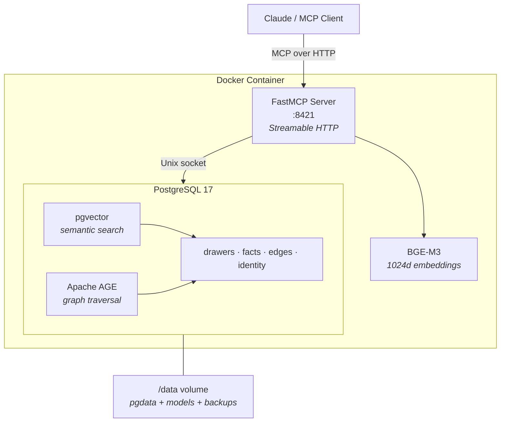

# HiveMem

Personal knowledge system with semantic search and temporal knowledge graph.

MCP server backed by PostgreSQL 17 (pgvector + Apache AGE) with BGE-M3 embeddings.

## Features

- 16 MCP tools (search, knowledge graph, time machine, wake-up, import, ...)
- Semantic search with BGE-M3 (1024 dims, 100+ languages, <1s queries)
- Temporal knowledge graph (valid_from/valid_until, historical queries)
- Multi-hop graph traversal (recursive CTEs / Apache AGE)
- Single container deployment (one command: `docker run`)
- Built-in backup command

## Prerequisites

- [Docker](https://docs.docker.com/get-docker/) (v20+)
- ~4 GB free disk space (BGE-M3 model ~2.2 GB + Docker image ~3.5 GB)
- ~3 GB free RAM (BGE-M3 embedding model runs on CPU)

## Installation

### 1. Clone and build

```bash
git clone https://github.com/ufelmann/HiveMem.git
cd HiveMem
docker build -t hivemem .
```

### 2. Run

```bash
docker run -d --name hivemem \
  -p 8421:8421 \
  -v hivemem_data:/data \
  --restart unless-stopped \
  hivemem
```

First start takes a few minutes — the container initializes PostgreSQL and downloads the BGE-M3 embedding model (~2.2 GB). Check progress:

```bash
docker logs -f hivemem
```

Alternatively, use Docker Compose:

```bash
docker compose up -d
```

### 3. Verify

```bash
curl -s http://localhost:8421/mcp \
  -H "Content-Type: application/json" \
  -d '{"jsonrpc":"2.0","id":1,"method":"tools/list"}' | head -c 200
```

### 4. Connect to Claude

Add to your MCP client config (Claude Desktop `claude_desktop_config.json` or Claude Code `.mcp.json`):

```json
{
  "mcpServers": {
    "hivemem": {
      "type": "http",
      "url": "http://localhost:8421/mcp"
    }
  }
}
```

All 16 `hivemem_*` tools should now be available.

### 5. Seed identity (optional)

Customize `scripts/seed-identity.py` with your own profile, then:

```bash
docker exec hivemem python3 scripts/seed-identity.py
```

## Backups

```bash
docker exec hivemem hivemem-backup
```

Dumps are saved to `/data/backups/` inside the volume (gzipped, last 7 days kept). For automated daily backups, add a cron job on the host:

```bash
0 3 * * * docker exec hivemem hivemem-backup
```

## Debugging

```bash
# PostgreSQL shell
docker exec -it hivemem psql -U hivemem

# Container logs
docker logs hivemem --tail 50

# Health check
curl -s http://localhost:8421/mcp \
  -H "Content-Type: application/json" \
  -d '{"jsonrpc":"2.0","id":1,"method":"tools/call","params":{"name":"hivemem_health","arguments":{}}}'
```

## Architecture



### Tools (16)

| Category | Tools |
|---|---|
| **Read** (9) | `search` · `search_kg` · `get_drawer` · `list_wings` · `list_rooms` · `traverse` · `time_machine` · `wake_up` · `status` |
| **Write** (4) | `add_drawer` · `kg_add` · `kg_invalidate` · `update_identity` |
| **Import** (2) | `mine_file` · `mine_directory` |
| **Admin** (1) | `health` |

## License

MIT
