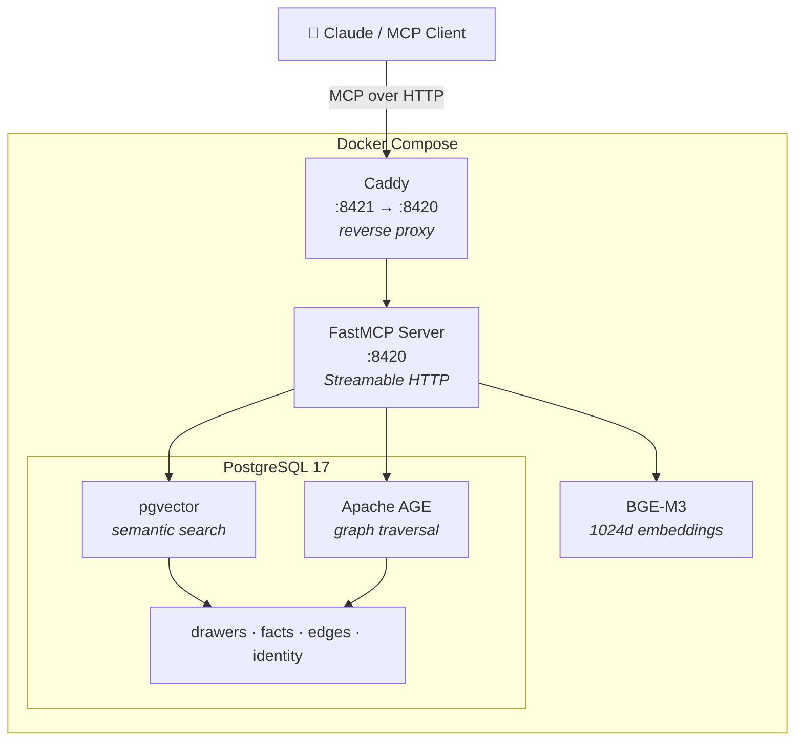

# HiveMem

Personal knowledge system with semantic search and temporal knowledge graph.

MCP server backed by PostgreSQL 17 (pgvector + Apache AGE) with BGE-M3 embeddings.

## Features

- 16 MCP tools (search, knowledge graph, time machine, wake-up, import, ...)
- Semantic search with BGE-M3 (1024 dims, 100+ languages, <1s queries)
- Temporal knowledge graph (valid_from/valid_until, historical queries)
- Multi-hop graph traversal (recursive CTEs / Apache AGE)
- Docker Compose deployment (one command: `docker compose up`)
- Daily pg_dump backups

## Prerequisites

- [Docker](https://docs.docker.com/get-docker/) and [Docker Compose](https://docs.docker.com/compose/install/) (v2+)
- ~4 GB free disk space (BGE-M3 model ~2.2 GB + Docker images ~1.5 GB)
- ~3 GB free RAM (BGE-M3 embedding model runs on CPU)

## Installation

### 1. Clone and configure

```bash
git clone https://github.com/ufelmann/HiveMem.git
cd HiveMem
cp .env.example .env
```

Edit `.env` to set your database password (optional — defaults to `hivemem_local_only` for local development):

```
HIVEMEM_DB_PASSWORD=your_secure_password
```

### 2. Build and start

```bash
docker compose up -d
```

This builds three containers:

| Container | What it does |
|---|---|
| **db** | PostgreSQL 17 with pgvector + Apache AGE (built from source) |
| **mcp** | FastMCP server on port 8420 (internal) |
| **caddy** | Reverse proxy on port 8421 (exposed) |

First start takes a few minutes — the MCP container downloads the BGE-M3 embedding model (~2.2 GB). Progress is visible in the logs:

```bash
docker compose logs mcp -f
```

### 3. Verify

```bash
# Check all containers are healthy
docker compose ps

# Test the MCP endpoint
curl -s http://localhost:8421/mcp \
  -H "Accept: application/json, text/event-stream" \
  -H "Content-Type: application/json" \
  -d '{"jsonrpc":"2.0","id":1,"method":"tools/list"}' | head -c 200
```

### 4. Connect to Claude

Add to your MCP client config (Claude Desktop `claude_desktop_config.json` or Claude Code `.mcp.json`):

```json
{
  "mcpServers": {
    "hivemem": {
      "type": "http",
      "url": "http://localhost:8421/mcp"
    }
  }
}
```

All 16 `hivemem_*` tools should now be available.

### 5. Seed identity (optional)

Customize `scripts/seed-identity.py` with your own profile, then:

```bash
# With the stack running:
docker compose exec mcp python scripts/seed-identity.py
```

This populates the wake-up layers (`l0_identity`, `l1_critical`) used by the `hivemem_wake_up` tool.

## Backups

Daily backups with `pg_dump`:

```bash
./scripts/backup.sh
```

Dumps are saved to `backups/` (gzipped, last 7 days kept). For automated daily backups, add a cron job:

```bash
0 3 * * * /path/to/HiveMem/scripts/backup.sh
```

## Local development

Run tests against the database (requires the `db` container to be running):

```bash
# Install dev dependencies
pip install -e ".[dev]"

# Run tests
pytest tests/ -v
```

## Architecture



### Tools (16)

| Category | Tools |
|---|---|
| **Read** (9) | `search` · `search_kg` · `get_drawer` · `list_wings` · `list_rooms` · `traverse` · `time_machine` · `wake_up` · `status` |
| **Write** (4) | `add_drawer` · `kg_add` · `kg_invalidate` · `update_identity` |
| **Import** (2) | `mine_file` · `mine_directory` |
| **Admin** (1) | `health` |

## License

MIT
