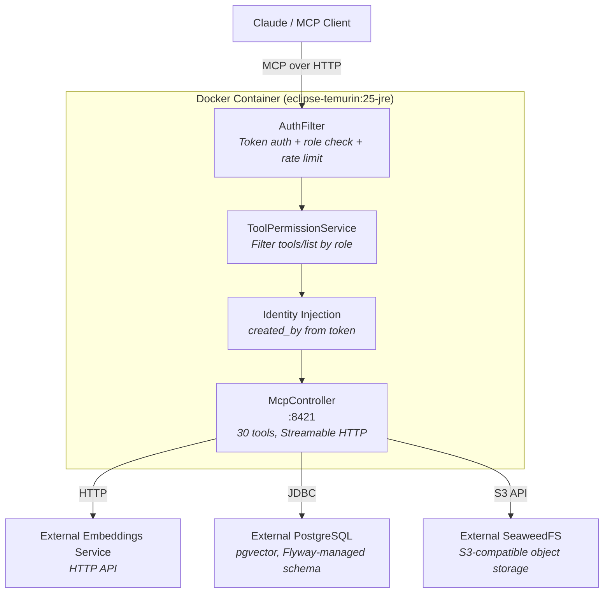
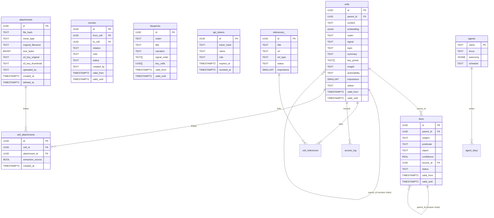

# Architecture

## Data Model

### Attachment ingestion

Each file upload (via `upload_attachment` or `POST /api/attachments`) automatically creates a new `pending` Cell. The cell content is set to the text extracted from the file; if no text could be extracted, the original filename is used as a fallback. The Classifier agent picks up `pending` cells asynchronously and enriches them with summary, key points, insight, and tags. The link between the attachment and its extraction cell is recorded in `cell_attachments` with `extraction_source = true`. If the caller also supplies an existing `cell_id`, a second `cell_attachments` row (or a `related_to` tunnel) is created to express that relationship.

## Security & Capability Matrix

Every HiveMem tool is mapped to a specific role to ensure least privilege. Write operations (excluding agents) and admin functions are protected by RBAC.

| Category | Tools | Access Role | Data Flow | HITL Required? | Description |
|---|---|---|---|---|---|
| **Search** | `search`, `search_kg`, `quick_facts`, `time_machine` | `reader` | Read Only | No | 6-signal semantic & keyword search. |
| **Read** | `status`, `get_cell`, `list_realms`, `traverse`, `wake_up`, `get_blueprint`, `history` | `reader` | Read Only | No | Navigation and context retrieval. |
| **Write** | `add_cell`, `kg_add`, `kg_invalidate`, `revise_cell`, `revise_fact`, `update_identity`, `update_blueprint` | `agent` | Propose Change | Yes (for Agents) | Append-only knowledge capture. |
| **Tunnels** | `add_tunnel`, `remove_tunnel` | `agent` | Link Discovery | Yes | Cell-to-cell semantic linking. |
| **Approval** | `approve_pending` | `admin` | Commit Change | Yes | Batch approve or reject pending agent writes. |
| **Agent** | `register_agent`, `list_agents`, `diary_write`, `diary_read` | `admin` | Fleet Management | Yes | Autonomous fleet orchestration. |
| **References** | `add_reference`, `link_reference`, `reading_list` | `agent` | Metadata | No | Source and citation tracking. |
| **Admin** | `health` | `admin` | System Management | Yes | DB connection, extensions, counts, disk. |

## Configuration

| Variable | Default | Description |
|---|---|---|
| `HIVEMEM_JDBC_URL` | (required) | JDBC connection string to PostgreSQL |
| `HIVEMEM_DB_USER` | (required) | PostgreSQL username |
| `HIVEMEM_DB_PASSWORD` | (required) | PostgreSQL password |
| `HIVEMEM_EMBEDDING_URL` | `http://localhost:8081` | URL of the external embeddings service |
| `HIVEMEM_EMBEDDING_TIMEOUT` | `PT5S` | HTTP timeout for embedding requests (ISO 8601 duration) |
| `SERVER_PORT` | `8421` | Port for the MCP server |

## Security & Compliance

- **Privacy First:** HiveMem is 100% self-hosted. Your data never leaves your infrastructure.
- **Auditability:** All tool calls and authentication events are logged to `/data/audit.log`.
- **SafeSkill Score:** **100/100 (Verified Safe)**. See [SafeSkill Report](https://safeskill.dev/scan/ufelmann-hivemem).
- **Transparency:** 7/7 points. See [SAFE.md](../SAFE.md) for the security manifest.
- **Human-in-the-Loop:** All agent writes require manual approval via `approve_pending`.
