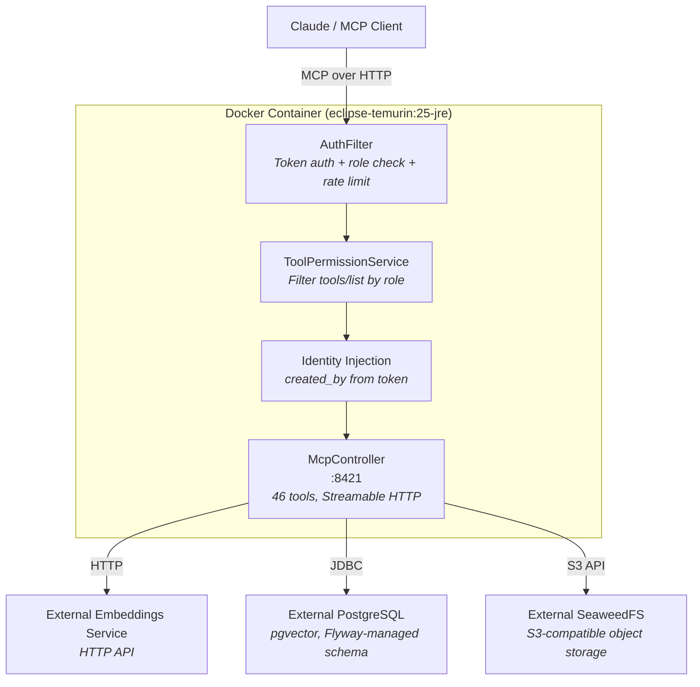
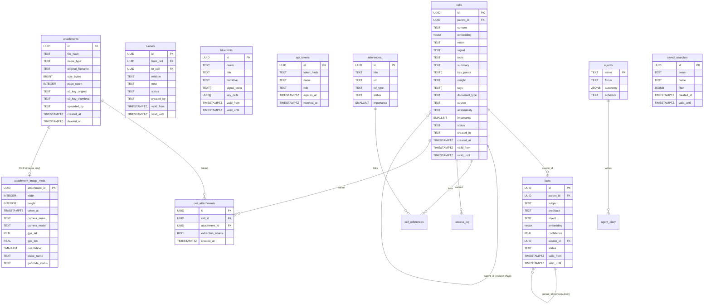

# Architecture

```mermaid
graph TB
    Client["Claude / MCP Client"]

    subgraph Container["Docker Container (eclipse-temurin:25-jre)"]
        Auth["AuthFilter<br/><i>Token auth + role check + rate limit</i>"]
        ToolGate["ToolPermissionService<br/><i>Filter tools/list by role</i>"]
        Identity["Identity Injection<br/><i>created_by from token</i>"]
        MCP["McpController<br/>:8421<br/><i>46 tools, Streamable HTTP</i>"]
    end

    EmbSvc["External Embeddings Service<br/><i>HTTP API</i>"]
    PG["External PostgreSQL<br/><i>pgvector, Flyway-managed schema</i>"]
    SeaweedFS["External SeaweedFS<br/><i>S3-compatible object storage</i>"]

    Client -->|"MCP over HTTP"| Auth
    Auth --> ToolGate
    ToolGate --> Identity
    Identity --> MCP
    MCP -->|"HTTP"| EmbSvc
    MCP -->|"JDBC"| PG
    MCP -->|"S3 API"| SeaweedFS
```

## Data Model

```mermaid
erDiagram
    cells {
        UUID id PK
        UUID parent_id FK
        TEXT content
        vector embedding
        TEXT realm
        TEXT signal
        TEXT topic
        TEXT summary
        TEXT[] key_points
        TEXT insight
        TEXT[] tags
        TEXT document_type
        TEXT source
        TEXT actionability
        SMALLINT importance
        TEXT status
        TEXT created_by
        TIMESTAMPTZ created_at
        TIMESTAMPTZ valid_from
        TIMESTAMPTZ valid_until
    }
    facts {
        UUID id PK
        UUID parent_id FK
        TEXT subject
        TEXT predicate
        TEXT object
        vector embedding
        REAL confidence
        UUID source_id FK
        TEXT status
        TIMESTAMPTZ valid_from
        TIMESTAMPTZ valid_until
    }
    tunnels {
        UUID id PK
        UUID from_cell FK
        UUID to_cell FK
        TEXT relation
        TEXT note
        TEXT status
        TEXT created_by
        TIMESTAMPTZ valid_from
        TIMESTAMPTZ valid_until
    }
    blueprints {
        UUID id PK
        TEXT realm
        TEXT title
        TEXT narrative
        TEXT[] signal_order
        UUID[] key_cells
        TIMESTAMPTZ valid_from
        TIMESTAMPTZ valid_until
    }
    api_tokens {
        UUID id PK
        TEXT token_hash
        TEXT name
        TEXT role
        TIMESTAMPTZ expires_at
        TIMESTAMPTZ revoked_at
    }
    agents {
        TEXT name PK
        TEXT focus
        JSONB autonomy
        TEXT schedule
    }
    references_ {
        UUID id PK
        TEXT title
        TEXT url
        TEXT ref_type
        TEXT status
        SMALLINT importance
    }
    attachments {
        UUID id PK
        TEXT file_hash
        TEXT mime_type
        TEXT original_filename
        BIGINT size_bytes
        INTEGER page_count
        TEXT s3_key_original
        TEXT s3_key_thumbnail
        TEXT uploaded_by
        TIMESTAMPTZ created_at
        TIMESTAMPTZ deleted_at
    }
    cell_attachments {
        UUID id PK
        UUID cell_id FK
        UUID attachment_id FK
        BOOL extraction_source
        TIMESTAMPTZ created_at
    }
    saved_searches {
        UUID id PK
        TEXT owner
        TEXT name
        JSONB filter
        TIMESTAMPTZ created_at
        TIMESTAMPTZ valid_until
    }
    attachment_image_meta {
        UUID attachment_id PK
        INTEGER width
        INTEGER height
        TIMESTAMPTZ taken_at
        TEXT camera_make
        TEXT camera_model
        REAL gps_lat
        REAL gps_lon
        SMALLINT orientation
        TEXT place_name
        TEXT geocode_status
    }

    cells ||--o{ facts : "source_id"
    cells ||--o{ cells : "parent_id (revision chain)"
    facts ||--o{ facts : "parent_id (revision chain)"
    cells ||--o{ cell_references : "links"
    references_ ||--o{ cell_references : "links"
    agents ||--o{ agent_diary : "writes"
    cells ||--o{ access_log : "tracked"
    cells ||--o{ cell_attachments : "linked"
    attachments ||--o{ cell_attachments : "linked"
    attachments ||--o| attachment_image_meta : "EXIF (images only)"
```

### Attachment ingestion

Each file upload (via `upload_attachment` or `POST /api/attachments`) automatically creates a new `pending` Cell. For PDF files, the page count is determined at ingest (via Apache PDFBox) and stored in `attachments.page_count` (INTEGER, `null` for non-PDF types). This field is exposed in the `get_cell` `attachments[]` list, `get_attachment_info`, and `list_attachments` responses. The cell content is set to the text extracted from the file; if no text could be extracted, the original filename is used as a fallback. The Classifier agent picks up `pending` cells asynchronously and enriches them with summary, key points, insight, and tags. The link between the attachment and its extraction cell is recorded in `cell_attachments` with `extraction_source = true`. If the caller also supplies an existing `cell_id`, a `related_to` tunnel is created between the new extraction Cell and the supplied cell.

### Document enrichment — summarizer output fields

The summarizer LLM is called once per ingested document. In addition to the narrative layers (summary, key points, insight) it now emits two additional structured fields:

| Field | Type | Description |
|---|---|---|
| `language` | ISO 639-1 string | Detected content language (e.g. `de`, `en`). Empty/null if the LLM cannot determine it. |
| `tax_relevant` | boolean | Whether the document is relevant for tax purposes (invoices, receipts, contracts with financial implications, etc.). |

**Tax tagging:** When `tax_relevant` is `true`, the enrichment pipeline applies a language-correct tag to the cell:

| Content language | Tag applied |
|---|---|
| `en` | `tax-relevant` |
| `de` (or unknown / blank) | `steuerrelevant` |

Unknown or blank language falls back to the instance default language (`HIVEMEM_LANGUAGE`, default `de`), so the fallback tag is `steuerrelevant` on a standard German-language instance.

**Document date → `valid_from`:** The extraction profiles (invoice, contract, other, image-document-scan) request a `document_date` fact from the LLM. If the fact is present, it is parsed by `DocumentDateParser`:

- Accepted formats: `YYYY-MM-DD` (strict ISO), `YYYY-MM` (expanded to first of month), `YYYY` (expanded to Jan 1).
- Plausibility window: `1970-01-01` … today + 1 day. Values outside the window are discarded.
- When a valid date is parsed, the cell's `valid_from` is set to that date so that timeline views and sort-by-date reflect the document's own date rather than the ingest timestamp.

### Image EXIF & geolocation

Image attachments (`image/*`) get a row in `attachment_image_meta` (1:0..1 with
`attachments`, only images get a row), populated synchronously at ingest by
`ExifExtractor` (the `metadata-extractor` library): pixel `width`/`height`, capture
date (`taken_at` from EXIF `DateTimeOriginal`, interpreted as UTC — EXIF carries no
timezone, so cross-timezone sort order can be off by the local UTC offset), `camera_make`/
`camera_model`, GPS `gps_lat`/`gps_lon`, and EXIF `orientation`. Thumbnails are rotated
upright per the EXIF orientation flag. EXIF failures never abort ingest.

When GPS coordinates are present, ingest publishes a `GeocodeRequestedEvent` and
`GeocodingService` (async, `@TransactionalEventListener` AFTER_COMMIT) reverse-geocodes them to a `place_name`
("City, CC") via a Nominatim endpoint, caching by rounded coordinates and throttling to
≤1 request/second. The resolution state is tracked in `geocode_status`
(`none` | `pending` | `done` | `failed`). Transient lookup failures (network/HTTP) keep
the row `pending` — an hourly sweep retries them; `failed` is reserved for a definitive
"no place found" answer. On startup the coordinate cache is seeded from already-resolved
rows so restarts don't re-hit Nominatim.

A one-time idempotent startup backfill (`ImageMetaBackfillRunner`) populates metadata for
images uploaded before this feature existed. The `list_media` MCP tool reads this table
for the photo gallery.

Configuration (`hivemem.geocoding.*`):

| Property | Default | Purpose |
|---|---|---|
| `hivemem.geocoding.enabled` | `true` | Master switch for reverse-geocoding |
| `hivemem.geocoding.base-url` | `https://nominatim.openstreetmap.org` | Reverse-geocode endpoint |
| `hivemem.geocoding.user-agent` | `HiveMem/1.0 (+https://github.com/visterion/hivemem)` | Required by Nominatim usage policy |

### Saved searches

The `saved_searches` table persists named filter presets for the Scans explorer UI. Each row belongs to an `owner` (token name) and stores the filter state as a `JSONB` blob. Soft-deletion is handled via `valid_until`; active rows have `valid_until IS NULL`. An index on `(owner) WHERE valid_until IS NULL` keeps lookups fast per user.

### Embedding dependency for OCR'd documents

OCR'd scan documents are typically long. `EmbeddingClient.encodeForCell` embeds a cell's
content directly whenever it fits within the active embedding backend's `maxChars()` (500
characters on the default ONNX backend, up to 8000 on the optional Ollama backend — see
[GPU embedding backend](#gpu-embedding-backend-optional)), and only returns `null` — no
embedding at ingest/OCR time — for content beyond that cap with no summary yet available. In
that case `WriteToolService.reviseCell` tags the cell `needs_summary`, and the scheduled
summarizer backfill (every 5 min) generates the summary and only then re-embeds the cell.
Documents that fit under the active backend's cap are embedded immediately at OCR time.

### Content dedup (re-scans)

Content-based dedup runs **after** the cell's embedding exists, so it can rely on pgvector recall:

- **Long documents:** dedup runs in `SummarizerService.summarizeOne`, once the summary has been generated and the cell re-embedded.
- **Short documents (≤500 chars):** dedup runs immediately at OCR time in `OcrService`. This
  gate uses the fixed `NeedsSummaryDecider` threshold (500 characters), not the active
  embedding backend's `maxChars()` — so on the Ollama backend, a document between 501 and
  8000 characters already has an embedding at OCR time but is still deferred to the
  summarizer's dedup pass, the same as a document that has no embedding yet at all.

`DocumentDedupService.findAndDiscardDuplicate` runs a two-stage check against current committed scan cells, and only ever discards cells whose `source` starts with `consumption:`: pgvector cosine recall (`recall-threshold`) then a normalized character-4-gram Jaccard gate (`text-threshold`). A confirmed re-scan (matching a strictly older cell) is soft-deleted, its attachment binary is removed if no other live cell references it, and a `duplicate_of` tunnel links it to the original. The check is best-effort: any error keeps the document. Note: byte-identical re-uploads are already deduped earlier by SHA-256 in `AttachmentService.ingest` — since the dedup fix, a re-upload also seeds the new cell with the existing extraction cell's already-enriched content (OCR/vision output, incl. `subtype_*` tags) instead of re-running the OCR/vision pipeline; this step covers same-content/different-bytes re-scans.

Configuration (`hivemem.consumption.dedup.*`):

| Property | Default | Purpose |
|---|---|---|
| `hivemem.consumption.dedup.enabled` | `true` | Enable content dedup of re-scanned documents |
| `hivemem.consumption.dedup.recall-threshold` | `0.92` | Cosine floor for HNSW candidate recall |
| `hivemem.consumption.dedup.text-threshold` | `0.85` | Jaccard floor confirming a duplicate |
| `hivemem.consumption.dedup.candidate-k` | `10` | Max HNSW candidates checked |

### Per-document confidence aggregate

The `facts` table has a `REAL confidence` column (range `[0, 1]`). The `get_cell` tool exposes a `confidence` optional field (requested via `include=['confidence']`) that is computed as `AVG(confidence) FROM active_facts WHERE source_id = cell.id`. The same aggregate is available in `list_documents` rows. Both return `null` when a cell has no active facts.

### Subject canonicalization (`kg_entity`)

Free-text `subject` values on `facts` fragment easily ("Acme Inc." vs "Acme" vs "ACME"), which defeats supersede/contradiction detection since it only compares within a single `(subject, predicate)` group. The `kg_entity` table (`id uuid` PK, `canonical_name text` unique/not-null, `aliases text[]`) is an alias registry populated via the `kg_alias` tool: it stores a canonical subject string plus its known alternate spellings, and retro-migrates any existing facts recorded under an alias onto the canonical subject (invalidate + re-add, preserving `valid_from`).

Once an alias is registered, subject resolution runs on both sides of the KG API: on the write path, `kg_add` resolves its incoming `subject` through the registry before insert, so a fact written under a known alias lands on the canonical subject automatically; on the read path, `entity_overview` resolves a queried subject the same way (including its `depth=quick` facts-only mode), so looking up any alias surfaces the canonical entity's facts. The `pg_trgm` extension (added alongside `kg_entity` in migration V0038) powers `data_quality_report`'s `potential_conflicts` section, which flags predicates with multiple distinct active subjects and ranks candidate subject pairs by trigram similarity — the discovery half of the canonicalization workflow, paired with `kg_alias` as the fix.

**Limitation:** the `kg_entity` alias registry itself is not propagated via the op-log/sync stream — only the resulting fact invalidate/add ops from `kg_alias`'s retro-migration are synced. On a multi-instance deployment, a peer whose registry hasn't been separately synced would not canonicalize its own new writes through that alias. Current production is single-instance, so this is a known follow-up rather than an active bug.

## Security & Capability Matrix

Every HiveMem tool is mapped to a specific role to ensure least privilege. Write operations (excluding agents) and admin functions are protected by RBAC.

| Category | Tools | Access Role | Data Flow | HITL Required? | Description |
|---|---|---|---|---|---|
| **Search** | `search`, `search_kg`, `entity_overview`, `time_machine`, `facet_count` | `reader` | Read Only | No | 6-signal semantic & keyword search. `search` supports optional `tags` (match-ANY array) and `status` filters. `facet_count` returns aggregate counts grouped by `tag`/`status`/`realm`/`year`/`signal`, plus `fact:<predicate>` fields (allow-listed: `vendor`, `party`, `amount_total`, `value_per_period`, `document_date`, `due_date`, `invoice_number`, `contract_number`). |
| **Read** | `status`, `get_cell`, `list`, `traverse`, `wake_up`, `get_blueprint`, `history`, `pending_approvals`, `reading_list`, `list_agents`, `diary_read`, `list_attachments`, `get_attachment_info`, `list_media` | `reader` | Read Only | No | Navigation and context retrieval. `get_cell` supports `include=['confidence']` for the per-document average fact confidence (nullable). |
| **Write** | `add_cell`, `kg_add`, `kg_invalidate`, `revise_cell`, `revise_fact`, `reclassify`, `update_identity`, `update_blueprint`, `upload_attachment`, `saved_searches`, `manage_tags` | `agent` | Propose Change | Yes (for Agents) | Append-only knowledge capture; tag management; saved-search persistence (the action-multiplexed `saved_searches` tool covers save/list/delete — listing is now `writer`-only). |
| **Tunnels** | `add_tunnel`, `remove_tunnel` | `agent` | Link Discovery | Yes | Cell-to-cell semantic linking. |
| **Approval** | `approve_pending` | `admin` | Commit Change | Yes | Batch approve or reject pending agent writes. |
| **Agent** | `register_agent`, `list_agents`, `diary_write`, `diary_read` | `admin` | Fleet Management | Yes | Autonomous fleet orchestration. |
| **References** | `add_reference`, `link_reference`, `reading_list` | `agent` | Metadata | No | Source and citation tracking. |
| **Admin** | `health`, `queen_runs`, `queen_run_detail`, `archivist_log`, `consumption_queue`, `consumption_retry` | `admin` | System Management | Yes | DB connection, extensions, counts, disk. `queen_runs`/`queen_run_detail` fetch Queen/Bee run history and event timelines from Vistierie. `consumption_queue` reports the scan ingest review queue (failed files, degraded batches, stalled rows, reconciliation counters); `consumption_retry` re-stages one scan file by its content hash. |

## Configuration

| Variable | Default | Description |
|---|---|---|
| `HIVEMEM_JDBC_URL` | (required) | JDBC connection string to PostgreSQL |
| `HIVEMEM_DB_USER` | (required) | PostgreSQL username |
| `HIVEMEM_DB_PASSWORD` | (required) | PostgreSQL password |
| `HIVEMEM_DB_POOL_MAX` | `20` | Hikari max pool size (sized for web traffic + scheduled sweeps) |
| `HIVEMEM_DB_POOL_MIN_IDLE` | `5` | Hikari minimum idle connections |
| `HIVEMEM_DB_CONNECTION_TIMEOUT_MS` | `10000` | Hikari connection-acquisition timeout (ms) — fail fast when the pool is saturated |
| `SESSION_COOKIE_SECURE` | `true` | `Secure` flag on the session cookie; set `false` only for plain-HTTP local setups |
| `HIVEMEM_EMBEDDING_URL` | `http://localhost:8081` | URL of the external embeddings service |
| `HIVEMEM_EMBEDDING_TIMEOUT` | `PT30S` | HTTP timeout per embedding request (ISO 8601 duration) |
| `HIVEMEM_EMBEDDING_MAX_RETRIES` | `3` | Retry attempts before abandoning an embedding request |
| `HIVEMEM_EMBEDDING_RETRY_BACKOFF_MS` | `500` | Base backoff (ms, exponential) between embedding retries |
| `HIVEMEM_EMBEDDING_BACKFILL_INTERVAL_MS` | `300000` | Embedding backfill sweep interval (ms) |
| `HIVEMEM_EMBEDDING_BACKFILL_BATCH_SIZE` | `50` | Max cells per embedding backfill sweep |
| `HIVEMEM_CONSUMPTION_RECOVERY_INTERVAL` | `5m` | How often the consumption recovery sweep runs |
| `HIVEMEM_CONSUMPTION_RECOVERY_STALE_THRESHOLD` | `30m` | Age at which a stalled ledger entry is re-staged. Applies to `processing` rows on every sweep; `staged` rows are re-staged by the startup sweep only (see the recovery-sweep section below) |
| `HIVEMEM_CONSUMPTION_FAILED_RETRY_LIMIT` | `3` | Max retries for files in `failed/` before they are left permanently |
| `SERVER_PORT` | `8421` | Port for the MCP server |

### `ranked_search` PostgreSQL function

The `ranked_search` stored function powers the `search` tool. It is **not** managed by Flyway; instead it is recreated on every startup by `EmbeddingMigrationService` from an in-code template. This is intentional — the function signature must stay in sync with the embedding vector dimension, which can change between deployments. As of SP-C1 the function accepts the optional parameters `p_tags TEXT[]` (match-ANY array overlap filter) and `p_status TEXT` (filter by cell status, default `committed`).

### Search weights, profiles, and confidence

`search` combines six signals (semantic, keyword, recency, importance, popularity, graph_proximity) into a `score_total`. The weight vector is chosen by the `profile` param — a fixed preset (`balanced` (default) | `semantic` | `recent` | `important` | `keyword`), where `balanced` equals the baseline `hivemem.search.weights` defaults. The legacy per-call `weight_*` params are soft-deprecated but still override individual weights when present.

`confidence_level` is computed **relative to the returned result-set**, not against absolute cutoffs. For each query, the mean and population standard deviation (`sigma`) of the returned hits' `score_total` values are computed once, then each hit is classified: `NONE` if `score_total` is below the absolute floor `hivemem.search.confidence.floor` (default `0.20`) or the result-set has fewer than 2 elements; `HIGH` if `score_total >= mean + sigma`; `LOW` if `score_total < mean`; `MEDIUM` otherwise (including when `sigma == 0` across the above-floor hits). The former absolute `hivemem.search.confidence.high`/`medium`/`low` properties have been removed. Both `score_total` and `confidence_level` are always returned; the five per-signal sub-scores are returned only when the caller passes `include=['scores']`.

### Facts embedding & semantic `search_kg`

`facts` carries a nullable `embedding vector` column (V0037), mirroring the cells lifecycle: `EmbeddingStateRepository.createFactsEmbeddingIndex`/`dropFactsEmbeddingIndex` manage an `idx_facts_embedding` HNSW index (cosine ops) whose dimension is (re)bound at startup by `EmbeddingMigrationService`, and a model/dimension change triggers a full facts re-encode alongside the existing cells re-encode. `active_facts` is a `SELECT *` view, so V0037 dropped and recreated it to carry the new column through.

On write, `WriteToolService.kgAdd`/`reviseFact` embed `subject + " " + predicate + " " + object` via `embeddingClient.encodeDocument(...)` and store the vector; embedding failures are caught and logged, never fail the fact write (the fact is stored with `embedding = NULL`). `EmbeddingBackfillService` runs a parallel facts pass (alongside its existing cells pass) that finds committed, active facts with `embedding IS NULL` and encodes them in the background.

`search_kg` gained an optional `query` param: when present, `ReadToolService.searchKg` embeds it via `encodeQuery` and calls `KgSearchRepository.semanticSearch`, which ranks `active_facts` by cosine distance (`embedding <=> query`) and returns a `score` field (`1 - cosine_distance`) alongside the usual triple fields; the existing `subject`/`predicate`/`object_` ILIKE filters still narrow the semantic result set. If embedding the query fails (or returns `null`), it falls back to the original ILIKE-only `search` path. Calling `search_kg` without `query` is unchanged.

## GPU embedding backend (optional)

The embedding sidecar (`embedding-service/`) supports two runtime backends behind a common
`/embeddings` + `/info` HTTP contract, selected by the sidecar's own `EMBEDDING_BACKEND` env
var:

- `onnx` (default) — CPU inference via onnxruntime. Advertises `max_chars: 500` via `/info`.
  This is what a plain `docker compose up -d` (no profile) runs; a clone without a GPU is
  unaffected by the backend that follows.
- `ollama` — proxies to a local Ollama server running a larger embedding model (default
  Qwen3-Embedding-8B). Advertises `max_chars: 8000`. Brought up with the compose `gpu`
  profile: `docker compose --profile gpu up -d`. Without that profile the `hivemem-ollama`
  service does not exist, so the sidecar's health check never turns green and `hivemem`
  (which `depends_on: condition: service_healthy` for the sidecar) never starts.

`HttpEmbeddingClient.maxChars()` reads the backend's advertised `max_chars` from `/info` and
caches it; `EmbeddingClient.encodeForCell` uses that value (not a hardcoded constant) to
decide whether a cell's content fits, falling back to the summary only when it doesn't. This
is why the backend choice changes summarizer load in practice, not just embedding quality —
see [summarizer.md](summarizer.md#why-summaries-still-matter).

The Ollama integration is provider-neutral: it only depends on Ollama's standard HTTP API
(`/api/embed`, `/api/tags`), so a CUDA-based Ollama image is a drop-in replacement for the
ROCm one used by default — no code change, only the compose image tag and device passthrough
differ. Device passthrough (e.g. `/dev/kfd` + `/dev/dri` for ROCm, the NVIDIA Container
Toolkit for CUDA) and sufficient VRAM for the configured model are host prerequisites, not
something HiveMem or the sidecar can provide.

The Qwen3 model is Matryoshka-trained (MRL), so the backend slices its native embedding
vector down to `EMBEDDING_DIMS` (default 1024, since pgvector's HNSW index caps at 2000
dimensions) and re-normalizes the slice to unit length before returning it — skipping the
re-normalization would make pgvector's cosine distance silently wrong. Ollama itself enforces
the input truncation (`truncate: true` + `options.num_ctx`), so the sidecar needs no
tokenizer of its own for this backend.

## Security & Compliance

- **Privacy First:** HiveMem is 100% self-hosted. Your data never leaves your infrastructure.
- **Auditability:** All tool calls and authentication events are logged to `/data/audit.log`.
- **SafeSkill Score:** **100/100 (Verified Safe)**. See [SafeSkill Report](https://safeskill.dev/scan/visterion-hivemem).
- **Transparency:** 7/7 points. See [SAFE.md](../SAFE.md) for the security manifest.
- **Human-in-the-Loop:** All agent writes require manual approval via `approve_pending`.

## Vistierie Integration (Queen + Bees)

HiveMem delegates agent scheduling and subagent dispatch to **Vistierie** — the agent runtime running on the LXC host. HiveMem is already a Vistierie tenant (used for `/llm/*` summarizer and vision calls); the Queen + Bees feature reuses that tenancy.

### Outbound: agent registration

On startup (when `hivemem.queen.enabled=true`), `VistierieAgentBootstrap` (in `com.hivemem.queen`) performs idempotent `PUT`/`POST` calls to Vistierie's `/agents` endpoint via `VistierieAgentClient`, registering two agent definitions:

- **`isolated-cell-bee`** — subagent; finds cells with no tunnels and proposes candidate connections.
- **`queen`** — cron agent; surveys knowledge and dispatches the Bee on a configurable schedule.

HiveMem authenticates these calls with the existing `HIVEMEM_VISTIERIE_TOKEN` (the same credential used for LLM calls).

### Inbound: `/vistierie/**` callbacks

Vistierie calls back into HiveMem over the `hivemem-net` Docker network via three endpoint groups:

| Path | Auth header | Purpose |
|---|---|---|
| `POST /vistierie/tools/find_isolated_cells` | `hivemem.queen.webhook-token` | Returns cells that have no outbound tunnels |
| `POST /vistierie/tools/read_cell` | `hivemem.queen.webhook-token` | Returns full cell detail for a given cell ID |
| `POST /vistierie/tools/search_similar_cells` | `hivemem.queen.webhook-token` | Returns cells semantically related to the given cell across all realms (excluding the cell itself) |
| `POST /vistierie/runs/done` | `hivemem.queen.completion-webhook-token` | Receives the Queen's aggregated output and writes each proposal as a `pending` tunnel |

All four endpoints live under `/vistierie/**`, which is **exempt from the global `AuthFilter` and `SessionAuthFilter`**. Each request is authenticated by a constant-time bearer-token check against the respective config property.

### Write isolation

HiveMem remains the **sole writer**. The Bee only proposes; `POST /vistierie/runs/done` ingests the aggregated proposals and inserts each as a `pending` tunnel. Those entries then flow through the existing approval workflow (`approve_pending`) before any change is committed to the knowledge graph.

### Audit / scheduling / kill switch

Scheduling (cron ticks), subagent dispatch (context-shielding), per-run cost accounting, and the per-tenant kill switch are all **owned by Vistierie** — stored in its `runs` and `llm_calls` tables, not duplicated in HiveMem. To halt all Queen/Bee activity, issue `POST /admin/tenants/hivemem/kill` on the Vistierie admin API.

> **Budget requirement:** The Vistierie tenant and each agent must have a daily/monthly budget set, or every cron tick returns 403. See the [Operations runbook](operations.md#queen--bees-on-vistierie-lxc-102) for the setup commands.

### HiveMem → Vistierie task dispatch (new direction)

The consumption pipeline is the **first instance of HiveMem initiating a
Vistierie run** rather than merely registering agents and waiting for Vistierie
to call back. When a multi-page PDF arrives in the consumption folder,
`VistierieSeparationClient` POSTs directly to
`/agents/document-separator/run`, supplying the page digests inside the run
`payload` and a `completion_webhook` URL that Vistierie calls when the
separation run finishes. HiveMem stores the returned `run_id` to correlate that
callback.

This establishes a new request/response pattern on top of the existing
callback-based integration:

| Direction | Mechanism | Who initiates |
|---|---|---|
| Agent registration | PUT/POST `/agents` | HiveMem (startup) |
| Tool calls during a run | POST `/vistierie/tools/**` | Vistierie (inbound) |
| Queen completion | POST `/vistierie/runs/done` | Vistierie (inbound) |
| **Task dispatch (new)** | **POST `/agents/{name}/run`** | **HiveMem (outbound, on demand)** |
| Separation result | POST `/vistierie/separation/done` | Vistierie (inbound) |

The intended long-term direction is for **all generative LLM work to live in
Vistierie** — models, budgets, scheduling, and audit traces owned there — while
HiveMem retains only local embedding inference. The consumption pipeline's
dispatch pattern is the first step toward that model.

### Queen-Log UI

The Queen-Log UI lets admins inspect past Queen and Bee runs without leaving HiveMem. The data path is:

1. The UI calls the `queen_runs` (list) or `queen_run_detail` (single run) MCP tools — both are **admin-only**.
2. Those tools delegate to `QueenRunsService`, which calls `VistierieRunsClient`.
3. `VistierieRunsClient` first attempts `GET /admin/runs` on Vistierie using the optional `HIVEMEM_QUEEN_VISTIERIE_ADMIN_TOKEN`. This admin endpoint includes per-run cost accounting (`llmCalls`, `costMicros`). If no admin token is configured, it falls back to the tenant-scoped `GET /runs` endpoint (same `HIVEMEM_VISTIERIE_TOKEN` used for LLM calls), which returns the same run list but without cost fields.
4. For run detail, `VistierieRunsClient` calls the tenant endpoint `GET /runs/{id}` for run metadata and `GET /runs/{id}/events` for the Vistierie event timeline; these are combined into the `queen_run_detail` response.
5. The approval queue shown alongside run history reuses the existing `pending_approvals` and `approve_pending` tools — no new endpoints or DB tables are required.

On a Vistierie outage, both tools degrade gracefully: `queen_runs` returns `{items:[],total:0,costAvailable:false,unavailable:true}` and `queen_run_detail` returns `{run:{},events:[],unavailable:true}`, allowing the UI to display an appropriate offline notice.

### Contradiction detection sweep

`ContradictionSweep` is a single `@Scheduled` tick (default hourly, gated behind `hivemem.contradiction.enabled`, default `false`) that drives two Vistierie judge agents in strict order: Stage A (`predicate_cardinality` model purpose) takes precedence over Stage B (`contradiction_judge` model purpose) whenever any predicate still lacks a cardinality verdict. Stage A asks, once per predicate, whether it is single-valued (e.g. `date_of_birth`) or multi-valued (e.g. `has_tag`) — the answer is cached in `predicate_cardinality` and gates everything downstream, since a multi-valued predicate cannot contradict by definition. Stage B then asks, per candidate pair of a single-valued predicate, whether two objects sharing a subject really denote different things (e.g. "München" vs. "Munich" does not). Both stages dispatch to Vistierie the same way the document-separator agent does (`POST /agents/{name}/run` with a `completion_webhook`), and both are throttled by a shared hard ceiling — `hivemem.contradiction.max-runs-per-day` (default 4) dispatched runs per UTC day — because the Vistierie backend shares a rate-limit window with interactive work.

**Freshness is never the judge's call.** Neither judge is asked which fact is current, and neither sees a timestamp; `ContradictionWinnerSelector` decides that afterwards in plain deterministic Java (newest `valid_from`, then newest `ingested_at`, then higher confidence). This split is deliberate: delegating "which fact wins" to a model scores far below a deterministic comparator on the MemoryAgentBench FactConsolidation benchmark (arXiv:2606.01435). Confirmed pairs land as `pending` in `fact_contradictions` for human review via `resolve_contradiction`; resolution runs through the existing op-logged `kg_invalidate` path so multi-master sync stays correct.

`model_purpose = "contradiction_judge"` and `model_purpose = "predicate_cardinality"` each require their own Vistierie routing rule, or their runs fail with "no routing rule" — the same requirement `model_purpose = "separator"` has (see [Consumption](consumption.md#known-limitations-and-assumptions)). This is Vistierie-side configuration, not something HiveMem enforces.

`hivemem.contradiction.enabled=true` requires `hivemem.queen.enabled=true` AND a non-blank `hivemem.queen.contradiction-webhook-token`: `ContradictionStartupGate` fails startup otherwise, because the judge agents are registered by the Queen bootstrap (which the Queen being off would skip) and the completion webhooks are rejected with 401 both while the Queen is off and while that token is blank (its default). The two judge agents (`contradiction-judge`, `predicate-cardinality-judge`) are themselves only registered by the Queen bootstrap when `hivemem.contradiction.enabled=true` — unlike the Bee/Queen/Separator/Archivist agents, which register whenever the Queen is on regardless of this flag.

A separate component, `ContradictionReconcileSweep`, recovers dispatched jobs whose Vistierie callback never arrives (crash, dropped webhook, …): it runs on `reconcile-interval` and reclaims any job stuck past `stale-threshold` so a lost callback cannot silently stall a predicate or pair forever.

Configuration (`hivemem.contradiction.*`):

| Property | Env var | Default | Description |
|---|---|---|---|
| `enabled` | `HIVEMEM_CONTRADICTION_ENABLED` | `false` | Master switch for the whole sweep. |
| `sweep-interval` | `HIVEMEM_CONTRADICTION_SWEEP_INTERVAL` | `PT1H` | How often the sweep ticks. |
| `reconcile-interval` | `HIVEMEM_CONTRADICTION_RECONCILE_INTERVAL` | `PT5M` | How often stale dispatched jobs are recovered. |
| `batch-size` | `HIVEMEM_CONTRADICTION_BATCH_SIZE` | `25` | Candidate pairs per Stage-B run. |
| `max-runs-per-day` | `HIVEMEM_CONTRADICTION_MAX_RUNS_PER_DAY` | `4` | Hard ceiling on dispatched runs per UTC day, shared by both stages. |
| `stale-threshold` | `HIVEMEM_CONTRADICTION_STALE_THRESHOLD` | `PT10M` | A dispatched job with no callback for this long is considered crashed. |
| `max-attempts` | `HIVEMEM_CONTRADICTION_MAX_ATTEMPTS` | `3` | Dispatches a single item may receive before it is parked as deferred. |
| `max-pairs-per-group` | `HIVEMEM_CONTRADICTION_MAX_PAIRS_PER_GROUP` | `3` | Cap on pairs contributed by one `(subject, predicate)` group per batch, so one large group cannot monopolize the daily quota. |
| `cardinality-batch-size` | `HIVEMEM_CONTRADICTION_CARDINALITY_BATCH_SIZE` | `10` | Predicates judged per Stage-A run. |
| `cardinality-samples` | `HIVEMEM_CONTRADICTION_CARDINALITY_SAMPLES` | `3` | Sample objects sent per predicate in the Stage-A payload. |

New `hivemem.queen.*` key added by this feature:

| Property | Env var | Default | Description |
|---|---|---|---|
| `contradiction-webhook-token` | `HIVEMEM_QUEEN_CONTRADICTION_WEBHOOK_TOKEN` | `""` | Bearer token HiveMem expects Vistierie to present on both `POST /vistierie/contradiction/done` and `POST /vistierie/cardinality/done`. Must be set when contradiction detection + queen are both enabled. |

## Language / i18n

The UI is bilingual (German + English), German-first. The startup default language
comes from a global backend property `hivemem.language` (env `HIVEMEM_LANGUAGE`,
default `de`), delivered to the SPA in the `wake_up` response as `default_language`.
The user can switch language in Settings; that choice is stored in `localStorage`
(`hivemem_locale`) and overrides the backend default on subsequent visits.

The summarizer's output-language default inherits the same global value
(`hivemem.summarize.language` defaults to `${HIVEMEM_LANGUAGE}`), but keeps its own
override `HIVEMEM_SUMMARIZE_LANGUAGE`.

## Admin backfill endpoints

One-shot idempotent endpoints (all require the `admin` role) for retroactively enriching
existing documents without re-deploying or re-ingesting files.

| Endpoint | Query param | Response fields | Purpose |
|---|---|---|---|
| `POST /admin/backfill-titles` | `limit` (default 200) | `titled` | Give already-summarized documents that have no topic/title a short LLM-generated title. |
| `POST /admin/backfill-tax-date` | `limit` (default 200) | `processed` | Set `valid_from` from an existing stored `document_date` fact and apply the appropriate tax tag (`steuerrelevant` / `tax-relevant`) via a cheap summary-only classifier. Cells without a stored `document_date` fact are **not** re-extracted from full text (too expensive); only the tax tag is backfilled for those. Idempotent: processed cells receive the marker tag `tax_scanned` and are skipped on subsequent runs. |
| `POST /admin/dedup-backfill` | `limit` (default 200), `after_created_at`, `after_id` | `checked`, `discarded`, `remaining`, `after_created_at`, `after_id` | Retro-dedup existing scans: walks live `consumption:`-sourced cells with status `committed` or `pending` oldest→newest and discards re-scans found via `DocumentDedupService`. Paged and resumable — the response cursor is a keyset over `(created_at, id)`; repeat with it until `remaining` is 0. Both cursor params must be given together (HTTP 400 otherwise, so a half cursor cannot silently restart the walk); `limit` is clamped to 1…1000. The walk is synchronous, so page size is request duration — loop with the default rather than raising it, since a reverse proxy in front of the application may cut a long request off. **Run only after embeddings have been backfilled** — give the startup `needs_summary` tagging plus one cycle of the 5-min summarizer first, otherwise long scans have no embedding to match on. |

The summarizer-dependent endpoints (`backfill-titles`, `backfill-tax-date`) return HTTP 503 `{"error":"summarizer disabled"}` when the summarizer bean is not available (i.e. `HIVEMEM_VISTIERIE_URL` is unset).

### Self-healing embedding backfill

On startup, `SummarizeBackfillStartupRunner` tags any live committed cell with `embedding IS NULL AND length(content) > 500` as `needs_summary`. The scheduled summarizer (every 5 min) then summarizes and re-embeds those cells. This restores semantic search for scans that previously missed their embedding (e.g. ingested before the embedding-dependency fix). A non-committed (e.g. `pending`) cell whose content exceeds the active backend's `maxChars()` has its vector cleared the same way during a model re-encode but is deliberately not tagged `needs_summary` there, since the summarizer only looks at committed cells; it self-heals once committed and picked up by this startup runner on a later boot.

### Consumption pipeline — error handling & recovery

The consumption pipeline is designed to tolerate transient failures without data loss and without operator intervention.

**Embedding client resilience.** `EmbeddingClient` uses a configurable timeout (default 30 s) and retry-with-exponential-backoff (default 3 retries, 500 ms base). If all retries are exhausted the client throws, and the ingest path commits the cell **without an embedding**, tagging it `embedding_pending`. Embeddings are therefore nullable — their absence never blocks ingestion.

**Embedding backfill sweep.** `EmbeddingBackfillService` runs on a fixed schedule (default every 5 min) and finds all committed cells tagged `embedding_pending`. Once the embedding service is healthy again it backfills them in configurable batches (default 50 per cycle) and removes the tag. Semantic search is restored automatically — no operator action needed.

**Exactly-once file staging via the `consumption_file` ledger.** Every file the watcher picks up is recorded in the `consumption_file` table with its SHA-256 content hash, in state `staged`, **before** the file is moved out of the watch root — this closes the window where a crash between the move and the (previously later) ledger write could strand a file that no recovery path could ever find again. State transitions: `staged` (registered, not yet picked up by a worker) → `processing` (a worker has started reading it) → `done` (committed) or `failed` (ingest error). Two edges are easy to miss: `staged → failed` when the recovery sweep finds a stale `staged` row with no physical file anywhere (retry budget exhausted at the same time, since retrying cannot help), and `done → failed` when a separation batch was marked `done` at dispatch and its later `apply` fails — the row is flipped back so the bounded retry owns it instead of leaving a terminal dead end. The `attempts` counter increments only when a row transitions into `processing`; staging (including re-staging an existing row) never counts as an attempt. Content-based dedup (`DocumentDedupService`) means re-queuing an already-committed file is safe — the second ingest is discarded as a duplicate.

**Reassembly partial-ingest → `failed/`.** When a multi-page PDF is separated into sub-documents by Vistierie and at least one sub-document fails to ingest, the entire batch is moved to `failed/`. Previously, remaining sub-documents would be silently dropped. With the ledger and the retry sweep, the whole batch can be re-attempted safely after the root cause is resolved.

**Recovery sweep.** `ConsumptionRecoverySweep` runs at startup and on a fixed interval (default 5 min) and handles three cases:

- Rows stuck in `processing` past the stale threshold (default 30 min) are re-staged, by **both** the scheduled and the startup run. Such a row was mid-ingest when the JVM was killed: both the single-file and the reassembly path touch `updated_at` once per page as a heartbeat, so staleness here really does mean the worker is gone.
- Rows stuck in `staged` past the same threshold are re-staged by the **startup run only**. This asymmetry is deliberate. `staged` means "registered, not yet started", and nothing bumps `updated_at` while a task merely waits its turn on the bounded worker executor — so during normal operation a stale `staged` row is usually just queued, and re-staging it would make the next poll submit a *second* task for a file that is still going to be processed by the first. After a restart the executor queue is empty by construction, which is exactly what makes "stale and staged" unambiguous at startup.
- Files in `failed/` with an attempt count below the retry limit (default 3) are moved back to the watch root for re-ingest. Files that exhaust the retry limit remain in `failed/` and require manual inspection.

A `staged` row is resolved against the **watch root** as well as `processing/` when the sweep checks whether a row still has a physical file: the ledger row is written before the move, so a crash in between leaves the file exactly where the poll found it. Only a row with no file in either location is marked as having no data.

Rows that stall without failing — still `staged` or `processing` past the stale threshold — are also listed by the `consumption_queue` tool (`stalledRows`), with filename, state and age, so an operator can re-stage one explicitly with `consumption_retry` instead of waiting.

See the [Bulk import runbook](operations.md#consumption-bulk-import) for operator-facing verification steps and config reference.
