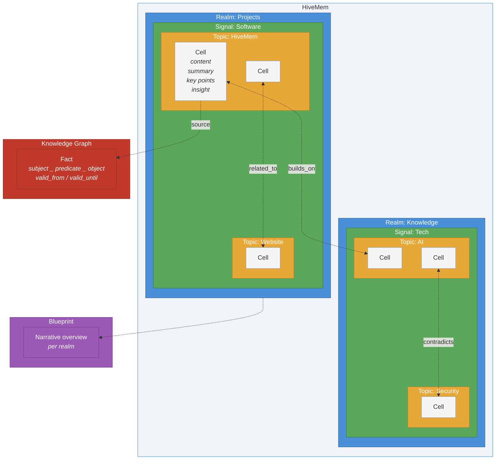

# The Structure

HiveMem organizes knowledge in a spatial hierarchy that is easy to navigate. Realms, signals, topics, and cells -- four levels from broad to specific. Tunnels connect cells across the entire structure, revealing hidden relationships in your knowledge.

## Concepts

| Concept | Description | Example |
|---|---|---|
| **Realm** | Top-level category | "Projects", "Knowledge", "Cooking" |
| **Signal** | A signal within a realm | "Software", "Italian Cuisine" |
| **Topic** | A topic within a signal | "HiveMem", "Pasta Recipes" |
| **Cell** | Single knowledge item with content, summary, key points, and insight | A design decision, a recipe, a meeting note |
| **Tunnel** | Passage connecting two cells | `builds_on`, `related_to`, `contradicts`, `refines` |
| **Fact** | Atomic knowledge triple in the knowledge graph | "HiveMem → uses → PostgreSQL" with temporal validity |
| **Blueprint** | Narrative overview of a realm | How signals, topics, and key cells in a realm connect |

## How It Works

1. **Store** -- Content is classified into realm/signal/topic and stored as a cell with progressive summarization (content, summary, key points, insight)
2. **Connect** -- Tunnels link related cells across the structure; facts capture atomic relationships in the knowledge graph
3. **Search** -- 6-signal ranked search finds cells by meaning, keywords, recency, importance, popularity, and graph proximity
4. **Traverse** -- Follow tunnels to discover hidden connections; use time machine to see what was known at any point
5. **Wake up** -- Each session starts with identity context and critical facts, like navigating back to your knowledge and remembering where everything is
