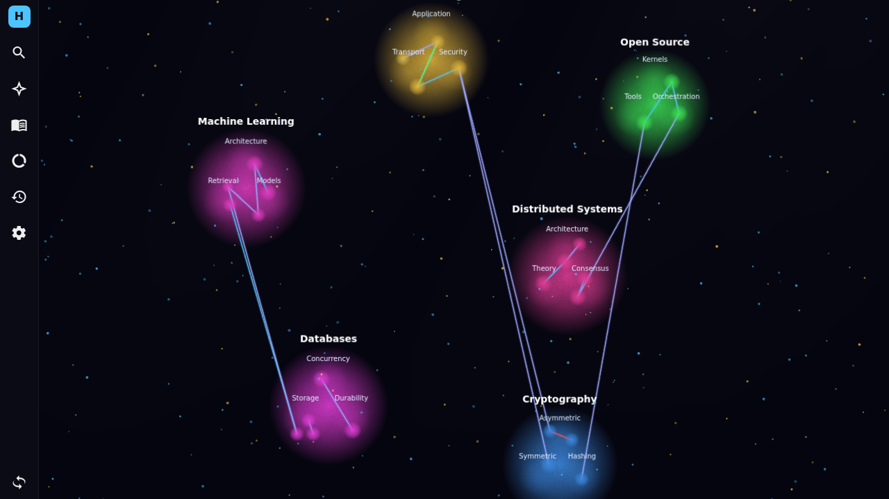
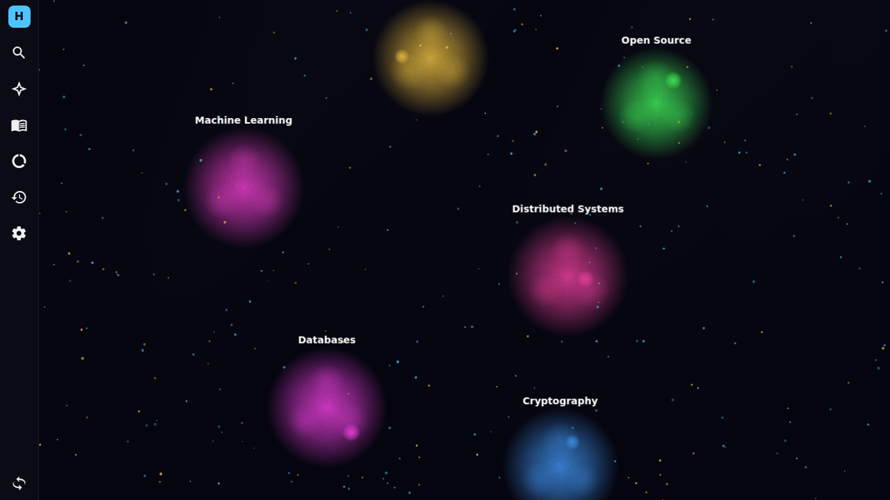
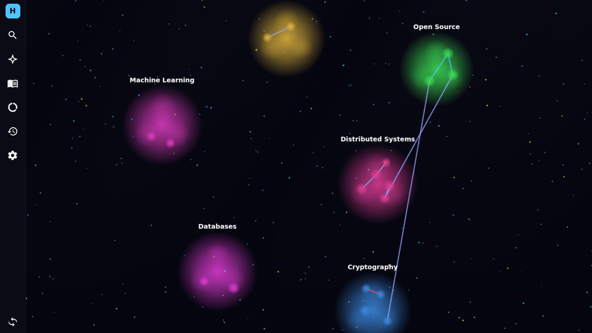
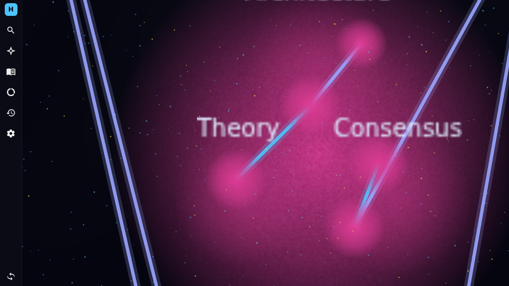

# knowledge-ui

Vue 3 + TypeScript + Vite frontend for HiveMem — a spatial knowledge palace
visualised on a PixiJS canvas. Cells (one knowledge entry each) are clustered
into signals, signals into realms, and relationships between cells are drawn as
coloured tunnels.



---

## What you see

| Element | Meaning |
| --- | --- |
| **Realm** (large glow) | Top-level section, e.g. *Distributed Systems*, *Cryptography* |
| **Signal** (smaller halo inside a realm) | Categorical subsection, e.g. *Consensus*, *Transport* |
| **Cell** (bright dot) | A single knowledge entry — title, markdown content, summary, key points, insight |
| **Tunnel** (line between cells) | Typed relationship: `builds_on` (blue), `related_to` (violet), `contradicts` (red), `refines` (green) |

Labels swap with zoom: realm names always visible, signal names appear at
zoom ≥ 0.7, cells vanish at zoom < 0.3 and are replaced by the realm glow.

---

## Streaming knowledge in

The mock backend ships a chronological dataset of landmark CS artifacts (Paxos
1998 → word2vec 2013 → QUIC 2021, etc.) and delivers them one at a time via a
**long-poll endpoint** — `hivemem_stream_next`. The client runs a simple loop:

```ts
while (!abort) {
  const { cells, tunnels, done } = await api.call('hivemem_stream_next', { timeout_ms: 25000 })
  this.cells  = [...this.cells,  ...cells]
  this.tunnels = [...this.tunnels, ...tunnels]
  if (done) break
}
```

A real backend would hold the HTTP request open until a new cell is committed;
the mock simulates this with a 0.9–1.4 s delay per response. Same client code.

The graph grows chronologically as cells arrive:

| Empty realms | Mid-stream | Fully populated |
| --- | --- | --- |
|  |  |  |

Each new cell fades/pops in; tunnels appear once **both** endpoints are visible.

---

## Interaction

- **Desktop:** mouse wheel to zoom, drag to pan.
- **Touch (iOS / Android):** one-finger drag to pan, **two-finger pinch** to zoom.
- **Tap** a cell to focus it; **double-tap** to open the markdown reader.



Realm layout is computed once with d3-force (cached across stream updates so
cells never jitter), signal sub-positions distribute evenly around the realm
centre, cell positions are deterministic poisson-disk sampling seeded on
`realm|signal` — early cells stay put as more arrive.

---

## Quick start

```bash
npm install
npm run dev       # http://localhost:5173
```

By default the UI boots against the **mock backend**. Toggle the checkbox in
the connect dialog; all demo data (26 cells, 20 tunnels, 15 facts, 16
references) lives in `src/data/mock.ts`.

To point at a real HiveMem server:

1. Uncheck **Use local mock data**.
2. Paste a bearer token (create with the `hivemem-token` CLI in the container).
3. The same `ApiClient` contract is implemented by `HttpApiClient` in
   `src/api/httpClient.ts`.

```bash
npm run build         # type-check + production bundle → dist/
npm run test:unit     # vitest
npm run test:e2e      # playwright
```

---

## Architecture notes

### Incremental canvas rendering

The sphere canvas is split into five layers:

```
realmLayer → signalLayer → edgesGraphics → cellLayer → labelLayer
```

New sprites are **appended** to the appropriate layer on each stream update;
nothing is torn down until the component unmounts. The edges object is the
only thing that gets `clear()`'d and rebuilt per update — O(tunnels) per event
stays negligible up to tens of thousands of tunnels.

Tracked sets (`renderedCellIds`, `renderedRealmNames`, `renderedSignalKeys`, …)
let the renderer skip already-drawn items in constant time.

### Capacity ceiling

| Hot cells in view | Behaviour |
| --- | --- |
| ≤ 10 000 | Smooth on desktop, ~60 fps at default zoom |
| ≤ 5 000 | Smooth on mid-range mobile |
| > 50 000 tunnels | Edge redraw starts eating frames — split `edgesGraphics` per realm |

Further headroom requires **viewport culling** (render only tiles currently on
screen) and tighter LOD at zoom < 0.3 where cells are already hidden.

### Key files

- `src/components/canvas/SphereCanvas.vue` — PixiJS scene, pointer/pinch
  gestures, incremental render pipeline.
- `src/stores/canvas.ts` — pinia store holding realms/cells/tunnels + the
  long-poll loop.
- `src/api/mockClient.ts` — in-memory API with the `hivemem_stream_next`
  long-poll simulation.
- `src/data/mock.ts` — the chronological CS knowledge seed.
- `src/composables/layout.ts` — d3-force realm placement + seeded poisson
  disk sampling for cells.
- `src/composables/lod.ts` — zoom thresholds for cell / label visibility.

---

## License

Same as the parent HiveMem repository.
